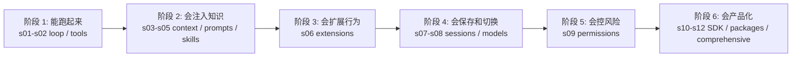

# Learn Pi Agent -- 极简 Coding Agent Harness 工程

> 学 Pi，不是追一个新的 agent 名词，而是学习一种更克制的 harness 设计：把强模型放进透明、可扩展、可回滚的终端环境里。

[English](README.md) | 中文

## 一句话定位

Pi 是一个极简终端 coding agent harness。它的核心不是“把智能写进流程图”，而是给已经具备 coding agency 的模型提供足够清楚的工作环境：少量工具、可观察上下文、可热加载扩展、可保存会话、可嵌入运行时。

截至 2026-05-28 已核验的官方事实：

- 官方仓库是 [earendil-works/pi](https://github.com/earendil-works/pi)。
- 官方文档入口是 [pi.dev/docs/latest](https://pi.dev/docs/latest)。
- CLI 包名已迁移到 `@earendil-works/pi-coding-agent`，旧的 `@mariozechner/*` 包从 `0.74.0` 起进入旧 scope 过渡期。
- 默认工具是 `read`、`write`、`edit`、`bash`；`grep`、`find`、`ls` 是可启用的内置只读工具。
- Pi 的扩展面包括 context files、prompt templates、skills、TypeScript extensions、packages，以及 SDK / RPC / JSON event stream 等集成方式。

## 为什么这个项目

参考项目 `learn-claude-code` 的完成度很高：它不是“资料汇总”，而是把一个复杂 agent harness 拆成递进课程，每章都有概念、代码和边界说明。

本仓库沿用这个产品思路，但学习对象换成 Pi：

- `learn-claude-code` 更适合理解一个成熟 coding harness 的完整机制。
- `learn-pi-agent` 更适合理解“极简、透明、自扩展”的 harness 取舍。
- 两者不是替代关系：一个偏完整系统解剖，一个偏最小可塑内核。

## Pi 的核心心法

```text
Pi = minimal terminal harness
   + unified multi-provider LLM API
   + agent loop
   + session storage
   + resource loader
   + TypeScript extensions
   + skills / prompts / context files
   + optional SDK / RPC embedding
```

更通俗地说：

```text
模型负责判断下一步。
Harness 负责让模型看见环境、调用工具、留下记录、守住边界。
Pi 的特别之处，是尽量少替模型做主。
```

## THE PI HARNESS PATTERN

```text
User prompt
   |
   v
messages[] + system prompt + resources
   |
   v
LLM response
   |
   +-- no tool call --> return text
   |
   +-- tool call ----> permission / extension hooks
                      |
                      v
              execute read/write/edit/bash
                      |
                      v
              append tool_result
                      |
                      v
                   loop
```

Pi 的“极简”不是没有工程，而是把工程集中在几个关键位置：

- 工具少：模型默认只拿到四把常用工具。
- Prompt 短：少用巨型系统提示词替模型“写性格”。
- 上下文透明：AGENTS.md、skills、prompts 都能被人看见和修改。
- 扩展靠边挂：复杂能力通过 extension / package 加进来，不污染主循环。
- 会话可追踪：session tree 保留分支和历史，便于回退与复盘。

## 12 章递进课程

> 目标：从一个最小 loop，走到能解释 Pi 真实产品结构的教学 harness。

> 先读 [00 机制地图](00_map/README.md):它讲清 Pi 的三层架构、四条横切线,并给出 AI 产品经理 / 平台设计者 / 工程读者三条跳读路径。**章号是顺序,机制地图才是结构。**

| 章节 | 主题 | 一句话 |
|---|---|---|
| [00](00_map/README.md) | 机制地图 | 三层架构 + 横切线 + 三条读者路径(建议先读) |
| [s01](s01_agent_loop/README.md) | Agent Loop | 一个循环 + 四个工具，是 Pi 的最小心脏 |
| [s02](s02_tool_dispatch/README.md) | Tool Dispatch | 加工具时改 registry，不改 loop |
| [s03](s03_context_files/README.md) | Context Files | AGENTS.md 是项目知识的入口，不是万能 prompt |
| [s04](s04_prompt_templates/README.md) | Prompt Templates | 可复用任务写成 `/command`，减少重复输入 |
| [s05](s05_skills/README.md) | Skills | 先暴露简介，用到时再加载完整工作流 |
| [s06](s06_extensions/README.md) | Extensions | TypeScript extension 把 hook、tool、command 接到 harness 上 |
| [s07](s07_sessions/README.md) | Sessions | session tree 让分支、回退、复盘成为产品能力 |
| [s08](s08_models/README.md) | Models | 多 provider 的难点不在 API 名字，而在消息与状态兼容 |
| [s09](s09_permissions/README.md) | Permissions | 极简工具也需要清晰边界 |
| [s10](s10_sdk_embed/README.md) | SDK Embed | Pi 可以作为引擎嵌进自己的应用 |
| [s11](s11_packages/README.md) | Pi Packages | 把 prompts、skills、extensions、themes 打包分发 |
| [s12](s12_comprehensive/README.md) | Comprehensive | 所有机制回到一个可解释的 harness |
| [s13](s13_compaction/README.md) | Compaction | 上下文经济学:旧消息换成结构化摘要 |
| [s14](s14_observability/README.md) | Observability | 把 agent 进度变成 trace 树,默认脱敏 |

## 如何阅读每章

每章都按同一套学习节奏组织，避免读者只看到零散概念：

1. 先看“本章要解决的问题”，确认这个机制为什么存在。
2. 再看“为什么上一章不够”，理解章节之间的递进关系。
3. 读“机制拆解”和图示，把抽象概念放进 harness 的运行链路里。
4. 跑 `code.mjs`，然后对照“代码导读”看教学 mock 如何表达机制。
5. 最后读“对应真实 Pi”和“教学简化 vs 生产差异”，区分官方事实、教学类比和本仓库的简化。

这套读法刻意把“产品机制”和“代码实现”分开：产品经理可以重点读问题、图示、边界；工程读者可以继续下钻到 mock code 和真实 Pi 文档。

## 章节学习地图

| 阶段 | 章节 | 你会建立的能力 |
|---|---|---|
| 最小运行时 | s01-s02 | 看懂 agent loop、tool call、tool registry，以及为什么工具接口比 prompt 技巧更稳定 |
| 上下文注入 | s03-s05 | 区分常驻规则、可复用 prompt、按需加载 skill，理解 progressive disclosure |
| 行为扩展 | s06 | 知道什么时候需要 TypeScript extension，以及 extension 为什么是强能力也是强风险 |
| 状态与模型 | s07-s08 | 理解 session tree、分支、模型切换、多 provider adapter 的产品复杂度 |
| 边界控制 | s09 | 把权限看成 harness gate，而不是一句“请小心”的 prompt |
| 产品化 | s10-s12 | 理解 SDK embedding、package 分发，以及如何把前面机制组装回一个完整 harness |

## 快速开始

本仓库的教学 demo 不依赖真实 LLM，也不需要安装 Pi；请从仓库根目录运行这些命令：

```bash
npm run check
node s01_agent_loop/code.mjs
node s12_comprehensive/code.mjs
```

如果你要体验真实 Pi：

```bash
npm install -g --ignore-scripts @earendil-works/pi-coding-agent
cd /path/to/project
pi
```

这里保留 `--ignore-scripts` 是为了降低全局安装第三方包时的生命周期脚本风险；如果官方安装说明后续变化，以最新文档为准。

项目内已经放了 Pi 原生资源样例：

```text
.pi/
  prompts/review.md
  skills/repo-review/SKILL.md
  extensions/protect-dangerous.ts
```

在真实 Pi 会话里，修改这些文件后运行 `/reload`，让资源重新发现。

注意：`.pi/extensions/protect-dangerous.ts` 是教学最小样例，不是生产级 shell sandbox 或完整权限系统。真实项目使用第三方或本地 extension 前，应先 review 源码和非交互模式行为。

## 学习路径



## 项目结构

```text
learn-pi-agent/
  README-zh.md              # 中文总纲
  README.md                 # English brief
  s01_agent_loop/           # 每章一个独立主题
    README.md
    code.mjs
  ...
  s12_comprehensive/
    README.md
    code.mjs
  .pi/                      # 可被真实 Pi 加载的项目级资源样例
    prompts/
    skills/
    extensions/
  docs/
    research-notes.md       # 资料核验与阅读顺序
  scripts/
    check-links.mjs         # 轻量自检
```

## 范围说明

这个仓库是教学项目，不是 Pi 官方文档，也不声明任何 Pi 内部实现细节。

为了让学习路径清楚，示例代码做了三类简化：

- `s01-s09` 用本地 mock 演示 harness 机制，不发起 LLM 请求。
- `.pi/` 下的 prompts、skills、extensions 是 Pi 原生资源样例，但不会在 `npm run check` 中执行真实 Pi。
- `s10-s11` 提供本地 mock demo，同时给出需要真实 Pi 依赖时的 reference 文件。

权衡很明确：先把 harness 设计看懂，再接真实依赖。这样学习成本最低，也更适合产品经理、平台架构师和想理解 agent 产品机制的人。

## 资料来源

核心资料见 [docs/research-notes.md](docs/research-notes.md)。优先级按“官方文档 > 官方仓库 > 官方新闻 > 第三方拆解 > 社区案例”排序。

本仓库创建时使用了附件 `pi-agent-harness-学习指南.md` 作为起点，但所有容易过期的事实都重新核验过，尤其是包名和仓库迁移。

## License

MIT
