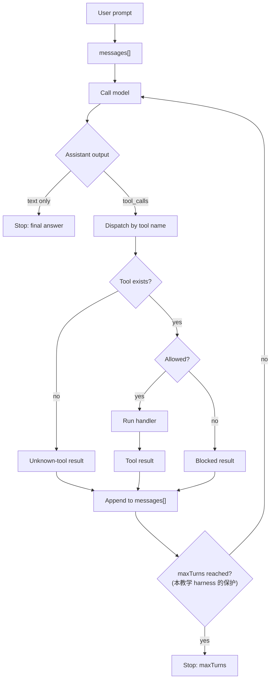

# s01 Agent Loop
## 本章要解决的问题
一个 coding agent harness 最小需要什么？
本章答案很克制：一份上下文、一个模型入口、一个工具注册表、一个循环、一个停止条件。
这五件事合起来，就是 agent loop。
它不是完整产品，但它是完整产品的心脏。
如果你理解了这个 loop，后面的工具派发、上下文文件、prompt template、skill、extension、session、权限和 SDK embed，都会变成“挂在 loop 周边的机制”，而不是一堆散开的名词。
## 为什么上一章不够
导论已经告诉我们：Pi 是 minimal terminal coding harness。
但产品经理不能只停在概念句。
真正要判断的是：模型什么时候回答文字，什么时候调用工具，工具失败后如何继续，未知工具要不要崩掉，模型一直调用工具时产品怎么止损，权限和扩展应该插在 loop 的哪里。
所以本章把 23 行概念卡片拆成一条可运行主路径。
你要记住一句话：
`tool_call` 不是异常路径，它是 agent loop 的主路径。
## 最小心智模型
把 agent 想成一个“会请求动作的文本模型”，不要把它想成一个直接操作电脑的实体。
模型本身不会读文件、写文件、跑命令。
它只能输出两类东西：
- 文本：给用户看的解释、计划、总结、最终答复。
- 工具调用：给 harness 的结构化请求，比如 `read({ path })` 或 `bash({ command })`。
Harness 负责三件事：
- 看懂工具调用。
- 执行工具调用。
- 把执行结果放回下一轮上下文。
下一轮模型看到工具结果后，继续决定：还要不要读更多文件，要不要编辑文件，要不要运行检查，是不是可以停下来回答用户。
这就是“循环”的含义。
## Mermaid 图示

这张图有两个产品含义：
- 工具错误不一定终止任务。很多时候，错误只是下一轮模型的输入。
- 必须有明确的停止边界,否则错误 prompt、坏工具描述或模型犹豫都可能导致无意义循环。本图用 `maxTurns` 表达这个边界,但这是**本教学 harness 的发明**;真实 Pi 把停止边界交给 `shouldStopAfterTurn` hook,loop 本身没有轮次计数器(详见下文 §7 和"对应真实 Pi")。
## 机制拆解
### 1. `messages[]` 是工作记忆
`messages[]` 不是普通聊天记录。
它同时承载用户目标、assistant 阶段性输出、工具调用请求、工具执行结果、错误和阻塞信息。
真实产品里还会有系统 prompt、上下文文件、压缩摘要、session 分支等。
本章先只保留最小结构，方便你看清 loop。
### 2. `tool_call` 是主路径
一个 coding agent 如果不能调用工具，就只能“建议你怎么改代码”。
有了工具，它才可以进入工作状态：
- `read`：读取文件，建立事实基础。
- `write`：创建或覆盖文件。
- `edit`：对已有文件做局部修改。
- `bash`：运行命令，获取环境和检查结果。
模型调用工具说明它知道自己缺事实，正在向环境要证据。
### 3. Registry 让 loop 保持简单
主循环不应该写成一串 `if call.name === "read"`。
更好的结构是 registry：
```js
toolRegistry.set("read", readHandler);
toolRegistry.set("bash", bashHandler);
```
这样新增工具时，扩展 registry，而不是改 loop。
这也是后续 extension 的基础。
### 4. Tool result 要稳定
工具返回值最好稳定成同一类结构：
- `tool_call_id`：对应哪次调用。
- `tool_name`：调用的是哪个工具。
- `content`：给模型看的结果。
- `isError`：这是不是一个错误结果。
为什么要有 `tool_call_id`？
因为同一轮 assistant 可能发出多个工具调用，没有 id，下一轮模型很难知道哪个结果对应哪个请求。
### 5. Unknown tool 是可恢复错误
真实系统可以选择硬失败，也可以把错误回灌给模型。
本章选择后者：
```text
unknown tool: search
```
这能展示一个重要点：harness 不需要假装工具存在，也不需要替模型猜测意图。
它只要把事实告诉模型，让模型自己修正路线。
### 6. Blocked command 是权限雏形
`bash("rm -rf dist")` 在本章会被阻止。
注意，阻止的不是 `bash` 工具本身，而是某个具体命令。
这对应真实产品里的权限门：工具存在，不代表每次调用都允许；允许 shell，不代表允许危险命令。
后面的权限章节会把这个点展开。
### 7. Stop condition 必须明确

本章教学 loop 演示两种停止:

- **自然退出**:assistant 这一轮没有再请求工具，且没有排队消息，循环结束。
- **`maxTurns` 上限**:循环超过本教学 harness 设定的上限，主动停止。

> ⚠️ 重要边界:`maxTurns` 是**本教学 harness 自己发明的保护机制**,不是 Pi 的内置概念。
> 我在整个 `packages/agent/src` 和 `packages/coding-agent/src` 里 grep 不到任何 `maxTurns` / `max_turns` 符号。
> 真实 Pi 的 loop(`packages/agent/src/agent-loop.ts`)没有数值轮次上限,它的停止靠三件事:
> - **自然退出**:本轮无 tool call 且无 steering/follow-up 排队消息 → 跳出循环发 `agent_end`(`agent-loop.ts:256`)。此时 assistant 的 `stopReason` 通常是 `stop`,**不是某个叫 `no_tool_calls` 的常量**。
> - **错误/中断**:streamed assistant 的 `stopReason` 为 `"error"` 或 `"aborted"` → 立即结束(`agent-loop.ts:196`)。
> - **每轮停止 hook**:调用方可提供 `config.shouldStopAfterTurn(ctx)`,返回 truthy 就在下一次 LLM 调用前结束(`agent-loop.ts:241`)。轮次限制(如果需要)就是用这个 hook 实现的,而不是 loop 内置计数器。

所以本章要记住的不是"Pi 有 max_turns",而是:**任何自动化 loop 都必须有明确的停止边界**;Pi 把"边界策略"交给调用方的 hook,而不是写死在 loop 里。这正体现 Pi"少替模型/调用方做主"的取舍。
## 代码导读
运行文件：
```bash
node s01_agent_loop/code.mjs
```
你会看到两段 demo 输出：
- `completed`：正常 agent loop，经历 read、bash、write、edit、blocked command、unknown tool，最后因为没有新的 tool call 而**自然退出**。
- `capped`：故意不停调用工具的模型，触发本教学 harness 的 `maxTurns` 上限而停止。再次提醒:`maxTurns` 是本 demo 的保护机制,真实 Pi 用 `shouldStopAfterTurn` hook 而非内置计数器实现等价边界。
代码里有四个关键区域。
第一段是内存工作区：
```js
const workspace = new Map([...]);
```
它模拟项目目录，但不会真的写磁盘。
第二段是工具注册：
```js
registerTool("read", async ({ path }) => ...);
registerTool("write", async ({ path, content }) => ...);
registerTool("edit", async ({ path, oldText, newText }) => ...);
registerTool("bash", async ({ command }) => ...);
```
四个工具名对应 Pi Quickstart 里默认给模型的四类能力。
第三段是 `runAgent()`：
```js
for (let turn = 1; turn <= maxTurns; turn += 1) {
  const response = await model({ messages, turn });
}
```
它就是本章的 agent loop。
第四段是 `executeTool()`，负责 dispatch、unknown tool 和错误结果回灌。
## 对应真实 Pi

> 事实基准:Pi monorepo commit `dbb9911a`(2026-05-30),npm `@earendil-works/pi-coding-agent@0.78.0`。
> 以下 `file:line` 仅对该 commit 有效;易过期点见末尾"事实核验清单"。

本章不是在复刻 Pi 内部实现，而是用最少代码复现 Pi 的关键产品结构。已逐行核验:

- 真实 agent loop 在 **`pi-agent-core`**(独立包 `packages/agent`),不在 coding-agent 里。低层 loop 是 `packages/agent/src/agent-loop.ts`:外层 follow-up 循环套内层 turn 循环,`while (hasMoreToolCalls || pendingMessages.length > 0)`(`agent-loop.ts:166`)。
- tool call 是主路径:loop 过滤 assistant 内容里 `type === "toolCall"` 的部分并执行,结果 push 回 LLM 上下文和返回 transcript(`agent-loop.ts:203,208`)。
- **停止条件**(本章重点,见上文 §7):自然退出(`agent-loop.ts:256`)、`stopReason` error/aborted(`agent-loop.ts:196`)、`shouldStopAfterTurn` hook(`agent-loop.ts:241`)。**无 maxTurns 计数器**。
- 生命周期事件名:`agent_start / agent_end / turn_start / turn_end / message_start / message_update / message_end / tool_execution_start / tool_execution_update / tool_execution_end`(`packages/agent/src/types.ts:403`)。
- 默认给模型四个工具 `read / write / edit / bash`,可选只读 `grep / find / ls`(`packages/coding-agent/docs/quickstart.md:77-84`;注册表 `core/tools/index.ts:83`)。
- 裸 loop 之上还有 **`AgentHarness` 编排层**(`packages/agent/src/harness/agent-harness.ts`):它管 phase(`idle | turn | compaction | branch_summary | retry`)、turn snapshot、save point、steer/followUp/nextTurn 队列、pending writes。本章只建模裸 loop;编排层在 s07/s12 展开。
- 官方仓库规范名 `earendil-works/pi-mono`(`/pi` 为别名);monorepo 含 `@earendil-works/pi-coding-agent`、`@earendil-works/pi-agent-core`、`@earendil-works/pi-ai`、`@earendil-works/pi-tui`。

官方入口:[Pi Documentation](https://pi.dev/docs/latest) · [Quickstart](https://pi.dev/docs/latest/quickstart) · 源码 [`agent-loop.ts`](https://github.com/earendil-works/pi-mono/blob/main/packages/agent/src/agent-loop.ts)。
## 教学简化 vs 生产差异
| 主题 | 本章教学版 | 真实生产版 |
| --- | --- | --- |
| 模型 | `scriptedModel`，固定剧本 | 真实 LLM，可能 streaming、重试、token 统计 |
| 文件系统 | `Map` 模拟文件 | 真实磁盘、路径解析、权限、并发写入队列 |
| 工具 schema | 只靠约定 | 需要参数 schema、校验、兼容处理 |
| 权限 | `bash` 里硬编码阻止危险命令 | 通过 extension 的 `tool_call` 门(单一 block)、用户确认、审计;Pi 没有独立的权限系统(见 s09) |
| 工具执行 | 顺序执行 | 可能并行执行，需要处理结果顺序和文件冲突 |
| 消息格式 | 简化为普通对象 | 真实 Pi 有 session、event、tool result 等更丰富类型 |
| 停止条件 | 自然退出 + 教学版 `maxTurns` 上限 | 自然退出 + `stopReason` error/aborted + `shouldStopAfterTurn` hook;无内置 maxTurns。还有 abort、compaction、retry、queue mode、session 切换 |
一个关键差异：真实 Pi extension 的 `tool_call` hook 可以在工具执行前拦截或修改输入。
本章把“阻止危险命令”放在 `bash` handler 内部，是为了让第一章代码更短。
后续章节会把它移到 loop 周边的 hook 机制。
## 练习
### 练习 1：改变停止上限
把 `maxTurns: 2` 改成 `maxTurns: 1`，观察 `capped.stopReason`(本 demo 自定义的字面值 `max_turns`)。
思考：为什么模型还没有机会“自己停下来”，产品就先停止了？
进阶：真实 Pi 没有 `maxTurns`。如果要在真实 Pi 上实现"最多 N 轮就停",你会用哪个机制?(提示:`shouldStopAfterTurn` hook,见上文 §7)
### 练习 2：新增一个只读工具
新增 `list` 工具，返回内存工作区中的文件名。
要求：不改 `runAgent()`，只通过 `registerTool("list", handler)` 增加能力。
如果你必须改主循环，说明 registry 的边界还没设计好。
### 练习 3：让 unknown tool 变成硬失败
修改 `executeTool()`：当前行为是返回 `isError: true` 的 tool result，目标行为是直接 `throw new Error(...)`。
思考：哪种更适合教学，哪种更适合 CI，哪种更适合交互式 coding agent？
### 练习 4：把 blocked command 移出 `bash`
新增一个 `beforeToolCall(call)` 函数。
如果是 `bash` 且命令包含 `rm -rf`，返回 blocked result；否则继续执行 handler。
这就是 extension hook 的最小雏形。
### 练习 5：给 tool result 增加 `details`
让 `bash("pwd")` 返回：
```js
{
  content: "...",
  details: { exitCode: 0, blocked: false }
}
```
思考：哪些信息应该给模型看，哪些信息应该留给 UI、审计或 session 恢复？
## 事实核验清单
写 Pi 教材时，下面这些点不要凭记忆写：
- agent loop 是否仍在 `packages/agent/src/agent-loop.ts`(独立 `pi-agent-core` 包,不在 coding-agent)。
- loop 是否仍**没有** `maxTurns` / `max_turns` 内置计数器(grep 确认),停止是否仍靠自然退出 + `stopReason` error/aborted + `shouldStopAfterTurn` hook。
- 生命周期事件名(`agent_start` 等十个)是否变化:`packages/agent/src/types.ts:403`。
- 当前安装包名是否仍是 `@earendil-works/pi-coding-agent`(npm 当前 `0.78.0`)。
- 官方仓库规范名是否仍是 `earendil-works/pi-mono`(`/pi` 别名)。
- Quickstart 中默认工具是否仍是 `read`、`write`、`edit`、`bash`,可选 `grep`、`find`、`ls`。
- SDK 是否仍使用 `createAgentSession()` 作为核心入口。
- AgentHarness 编排层的 phase 集与队列语义是否变化。
- `tool_call` hook 的触发时机、可修改输入、可阻止调用的语义是否变化。
如果其中任何一项变化，本章需要更新。
不要把历史包名、旧仓库地址或旧命令当成“常识”沿用。
## 小结
Agent loop 的核心不是“自动化很智能”。
它的核心是一个朴素闭环：模型提出动作，harness 执行动作，结果回到上下文，模型再判断下一步。
Pi 的很多能力都可以从这条闭环上找到位置：context files 改变初始上下文，prompt templates 改变输入展开方式，skills 改变可按需读取的操作说明，extensions 改变工具和事件，sessions 保存每一轮消息，SDK 把 loop 嵌进你自己的产品。
学 Pi，先学会看这个 loop。

## 延伸阅读

- 读 s02 时，重点观察“工具执行”如何从本章的简单对象变成 registry、schema、active tool pool 和 permission 的组合。
- 读 s06 时，再回头看本章的 blocked command：它应该从 handler 里搬到 extension hook，这就是从教学 loop 走向可扩展 harness 的第一步。
- 读 s12 时，把本章的 `runAgent()` 当作骨架；后面所有章节都只是往这个骨架周边增加可观察、可控制、可恢复的产品机制。
- 如果你只记住一句话，就记住：agent loop 不替模型思考，但它决定模型能看见什么、能调用什么、结果如何被保存。
