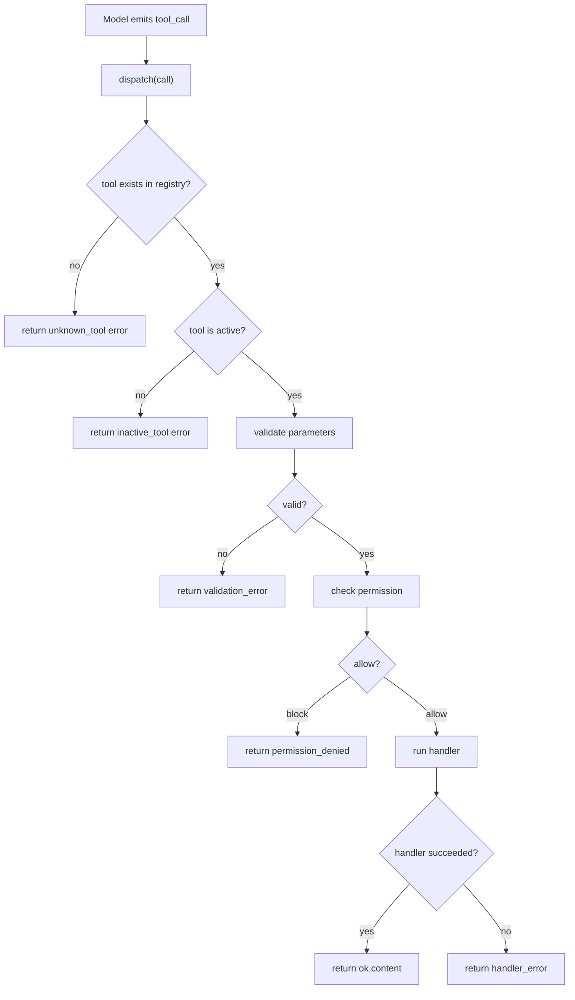

# s02 Tool Dispatch

## 本章要解决的问题

上一章的 agent loop 已经能跑起来：模型说要调用工具，harness 执行，再把结果塞回上下文。
但一旦工具从 1 个变成 10 个，真正的问题就出现了：

- 工具名从哪里查？
- 参数错了谁负责拦？
- 哪些工具此刻允许模型看到？
- 权限拒绝、工具报错、未知工具，应该怎样稳定返回？
- 新增工具时，是否要改主循环？

本章的答案是：把工具调度做成一个清晰的分层系统，而不是把所有逻辑写进 loop。

你可以把 tool dispatch 理解成 agent 的“操作台接线板”：

- 模型只提交一个 `tool_call`：工具名 + 参数。
- harness 用 registry 找到工具定义。
- schema 层先验证参数。
- active tool pool 判断这个工具此刻是否可见、可用。
- permission 层判断是否允许执行。
- handler 层真正做事。
- 所有结果统一包装后返回给模型。

## 为什么上一章不够

s01 的重点是解释 agent loop，所以它故意把工具部分讲得很轻。
在教学上这是对的：先让你看见“模型决定、harness 执行、结果回填”这个闭环。

但在真实产品里，只靠上一章的写法会很快失控：

- 主循环里出现大量 `if/else`，新增工具就要改核心流程。
- 参数校验散落在 handler 内，错误提示不稳定。
- 工具是否启用、是否需要确认、是否危险，没有统一入口。
- handler 返回字符串、对象、异常混在一起，模型拿到的结果不可预测。
- UI 想展示“调用中、已拒绝、失败、成功”时缺少稳定结构。

所以本章要补上工具层的骨架。
它不是为了把 demo 变复杂，而是为了让后面讲 extension、permission、SDK 时，有一套共同语言。

## 机制拆解

一个工具至少有五部分。
这五部分最好分开看，不要揉成一个大函数。

| 层次 | 负责什么 | 不负责什么 |
|---|---|---|
| `name` | 给模型和 registry 使用的稳定 ID | 不写业务逻辑 |
| `description` | 告诉模型什么时候该用这个工具 | 不承担权限控制 |
| `parameters` | 描述输入 schema，并做基础校验 | 不读取真实文件或网络 |
| `permission` | 决定 allow、ask、block | 不直接执行业务动作 |
| `handler` | 执行真实动作并返回结果 | 不决定自己是否可见 |

### 1. Registry：工具注册表

registry 是一个 `Map<toolName, toolDefinition>`。
它解决的是“工具名如何找到 handler”的问题。

新增工具时，我们希望注册一个 definition，而不是去 agent loop 里加新的 `if/else`。
这就是 dispatch map 的价值：主循环只懂“查表、校验、执行、包装结果”，不懂每个工具的细节。

### 2. Schema：参数契约

schema 的价值不是“让代码显得工程化”，而是降低模型调用工具时的歧义。

比如 `read` 工具需要 `path` 必填且必须是字符串，未声明字段可以拒绝。
对人类产品经理来说，schema 可以理解成“工具表单”：模型不是直接执行任意代码，而是在填写一个结构化表单。

本章的 `code.mjs` 用无依赖的简化 schema。
真实 Pi extension 示例里使用 `typebox` 的 `Type.Object(...)` 描述参数。

### 3. Active Tool Pool：当前可用工具池

registry 里有所有已注册工具，不代表每一轮都要给模型看。

active tool pool 解决的是“此刻哪些工具开放给模型”的问题。
它的好处有三个：降低模型选择成本，降低危险工具误触风险，并支持只读模式、编辑模式、调试模式等切换。
边界要分清：registry 是“系统知道有哪些工具”，active tool pool 是“这一轮允许模型调用哪些工具”。

### 4. Permission：执行前的最后一道门

active tool pool 只回答“工具是否开放”。
permission 还要回答“这次具体调用是否允许”。

例如 `write` 工具可能在编辑模式中是 active 的，但具体写入 `.env` 时仍应被拦住。

权限层常见结果是 `allow`、`ask`、`block`。
本章 demo 为了无依赖、可直接运行，只实现 `allow` 和 `block`。
后续 s09 会更集中地讲权限策略。

### 5. Unified Result：统一返回结构

工具层最怕“有时返回字符串，有时 throw，有时返回对象”。
模型和 UI 都会因此难以消费结果。

本章统一成：

```js
{ ok: true, content: [{ type: "text", text: "..." }] }
```

或者：

```js
{ ok: false, error: { code: "validation_error", message: "..." } }
```

这不是说真实 Pi 的内部结构就完全等于本章写法。
本章的重点是把“成功内容”和“失败原因”稳定拆开。

## Mermaid 图示



## 代码导读

运行：

```bash
node s02_tool_dispatch/code.mjs
```

这份代码刻意保持无依赖。
它不是 Pi extension 的真实源码，而是一份可读的机制模型。

重点看 6 个函数：

| 函数 | 作用 |
|---|---|
| `registerTool()` | 把工具定义放入 registry |
| `setActiveTools()` | 切换当前可调用工具池 |
| `validateParameters()` | 做最小参数校验 |
| `checkPermission()` | 把权限策略归一成 allow/block |
| `dispatch()` | 串起查表、active、schema、permission、handler |
| `resultToText()` | 把统一结果转成 demo 可读输出 |

代码里注册了三个工具：`read` 读取虚拟文件，`grep` 搜索虚拟文件，`write` 写入虚拟文件但默认不在 active tool pool。
演示会覆盖正常读取、正常搜索、调用未启用工具、参数缺失、未知工具、权限拒绝写 `.env`、打开 `write` 后写入普通文件。

这比上一章多了一点代码，但主线仍然很朴素：

```text
call -> registry -> activeTools -> schema -> permission -> handler -> result
```

## 对应真实 Pi

以下事实已按官方资料核验：

- Pi 默认给模型 `read`、`write`、`edit`、`bash` 四个工具；`grep`、`find`、`ls` 等只读工具可通过 tool options 启用。
- Pi extension 可以通过 `pi.registerTool(definition)` 注册自定义工具。
- extension 的 `tool_call` 事件可以在工具执行前检查或阻止调用。
- extension API 暴露 `pi.getActiveTools()`、`pi.getAllTools()`、`pi.setActiveTools(names)`。
- SDK 中 `session.agent.state.tools` 表示当前 agent 可用工具集合。

资料入口：

- [Pi Quickstart](https://pi.dev/docs/latest/quickstart)
- [Pi Extensions](https://pi.dev/docs/latest/extensions)
- [Pi SDK](https://pi.dev/docs/latest/sdk)

本章没有把 Pi 描述成一个“魔法框架”。
更准确的说法是：Pi 是一个 coding agent harness，它把模型、工具、上下文、权限、扩展和 UI 组织在一起。
tool dispatch 是其中连接“模型意图”和“真实操作”的关键机制。

## 教学简化 vs 生产差异

本章为了可读性做了这些简化：

- schema 只支持 `string`、`number`、`boolean`、`enum` 和 required 校验。
- handler 只操作内存里的 `virtualFiles`，不会碰真实文件系统。
- permission 只返回 `allow` 或 `block`，没有真的弹窗询问用户。
- active tool pool 由 demo 手动切换，没有跟 UI 模式或配置文件联动。
- 错误对象很小，只保留 `code` 和 `message`。
- 没有实现流式输出、取消信号、进度更新、结果截断和自定义渲染。

真实生产里通常还需要完整 JSON Schema 或 TypeBox 校验、细粒度权限、可审计日志、用户确认 UI、并发控制、输出截断和工具版本管理。

## 练习

1. 给 `read` 增加一个可选 `limit` 参数，只返回前 N 个字符。
2. 给 `grep` 增加 `caseSensitive` 布尔参数，默认不区分大小写。
3. 新增一个 `list` 工具，返回 `virtualFiles` 里的所有路径。
4. 把 `write` 的权限策略改成：写 `.md` 允许，写 `.env` 拒绝，写其他后缀需要 ask。
5. 让 `dispatch()` 在返回错误时带上 `tool` 字段，方便 UI 定位。
6. 思考：如果 active tool pool 为空，模型应该继续推理、请求用户授权，还是直接停止？

## 事实核验清单

写或改这一章时，请逐项检查：

- 是否仍然只声称 Pi 默认工具为 `read`、`write`、`edit`、`bash`？
- 如果提到 `grep`、`find`、`ls`，是否说清它们是额外可启用的只读工具？
- 是否把 custom tool 的入口写成 `pi.registerTool(...)`？
- 是否把 extension 位置写成 `~/.pi/agent/extensions/` 或 `.pi/extensions/` 时，再次核验官方文档？
- 是否避免把本章的无依赖 schema 说成真实 Pi 的完整实现？
- 是否说明 permission、active tool pool、handler 是不同层次？
- 是否把工具错误包装成稳定结构，而不是让异常直接暴露给模型？
- 是否提醒长输出需要截断或保存到文件，而不是无限塞进上下文？

## 小结

工具调度的核心不是“能不能调用函数”，而是把工具变成可注册、可校验、可启停、可授权、可观察的产品机制。
学完本章后，你应该能读懂：extension 为什么能添加新工具，permission 为什么挂在工具调用前，SDK 为什么要暴露当前 agent 的 tools 状态。
