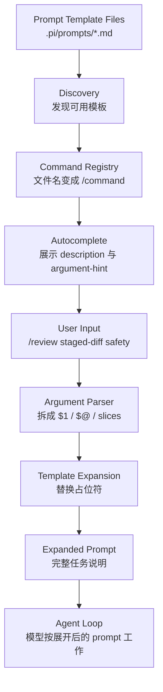

# s04 Prompt Templates

## 本章要解决的问题

很多 agent 任务不是新问题，而是重复问题：review 一段 diff、整理 issue、生成测试计划、把模糊需求改写成结构化 prompt。

如果每次都靠人手写完整 prompt，会出现三个产品问题：

- 入口不稳定：同一个任务，每个人叫法不同，模型收到的指令也不同。
- 口径不稳定：今天强调安全，明天忘了测试，后天又漏了读者对象。
- 成本不稳定：用户要记住整段 prompt，而不是只记住一个命令。

Prompt template 要解决的就是这个问题：把高频 prompt 固化成可发现、可复用、可带参数的 slash command。

它不是让模型“更聪明”的魔法，而是 harness 的一层产品机制：发现模板文件、生成命令名、读取 frontmatter、替换参数、把展开后的 prompt 交给 agent loop。

本章重点是 frontmatter、slash command、参数替换，以及 template 和 skill 的边界。

## 为什么上一章不够

上一章 `s03_context_files` 讲的是 context file：把长期、稳定、几乎每轮都要生效的项目规则放进上下文。

但 context file 不适合解决“某个具体任务的完整操作说明”。

例如：

- `/review` 应该看 correctness、missing tests、safety。
- `/issue` 应该输出现象、影响、复现、验收标准。
- `/commit-msg` 应该根据 diff 生成简短提交信息。
- `/release-note` 应该按用户、产品、工程三个视角整理变更。

这些内容不一定每轮都需要。如果全部塞进 `AGENTS.md`，会让常驻上下文变长，也会干扰无关任务。

| 机制 | 解决的问题 | 什么时候加载 |
|---|---|---|
| Context file | 这个项目里长期应该怎么做 | agent 启动或资源加载时 |
| Prompt template | 这类重复任务应该怎么问 | 用户输入 slash command 时 |

一句话：Context file 是项目规矩，prompt template 是可复用任务入口。

## Mermaid 图示



这张图的关键点是：slash command 本身不是 tool call。它更像编辑器里的“展开动作”：用户输入短命令，harness 把它变成完整 prompt，再进入正常 agent loop。

## 机制拆解

1. discovery：Pi 从全局、项目、package、settings、CLI 指定路径发现 prompt templates。
2. naming：模板文件名变成命令名，例如 `review.md` 变成 `/review`。
3. metadata：frontmatter 里的 `description` 和 `argument-hint` 用于命令列表和自动补全。
4. body：frontmatter 之后的 Markdown 正文才是要展开的 prompt。
5. parsing：用户输入 `/review "the staged diff" safety` 后，命令名是 `review`，参数是两个 token。
6. substitution：模板里的 `$1`、`$@`、`$ARGUMENTS`、`${@:N}` 被替换成用户参数。
7. handoff：展开后的 Markdown prompt 被交给模型，不需要用户手动复制长指令。

机制价值不在“替换字符串”本身，而在于把团队最佳实践变成可发现入口。

## Frontmatter

Prompt template 的 frontmatter 是 Markdown 文件开头的一小段元数据。

```md
---
description: Review the current repository changes
argument-hint: "[focus]"
---

Review the current repository changes.

Additional focus: $ARGUMENTS
```

`description` 告诉用户这个命令做什么；`argument-hint` 告诉用户参数怎么填，例如 `<target>` 表示必填，`[focus]` 表示可选。

如果没有 `description`，官方文档当前描述为：Pi 会使用正文里的第一行非空内容作为描述（截断到 60 字符，超出时追加 `...`）。(`packages/coding-agent/src/core/prompt-templates.ts:112-120`)

教学上可以把 frontmatter 理解为“命令卡片”，正文理解为“真正的 prompt”。

## Slash Command

假设项目里有 `.pi/prompts/review.md`，用户在 Pi 里输入 `/review staged-diff`。

这里有三个层次：文件路径是 `.pi/prompts/review.md`，命令名是 `/review`，参数是 `staged-diff`。

命令名应该短、稳定、好记。不要把命令名写成完整句子，也不要把多个不同意图混在一个命令里。

Prompt template 最适合“入口轻、动作清楚、参数少”的任务。

## 参数替换

真实 Pi 的 prompt templates 支持这些常用占位符：

| 写法 | 含义 |
|---|---|
| `$1`, `$2` | 第 1 个、第 2 个参数 |
| `$@` | 所有参数，用空格连接 |
| `$ARGUMENTS` | 所有参数，用空格连接 |
| `${@:N}` | 从第 N 个参数开始到末尾 |
| `${@:N:L}` | 从第 N 个参数开始，取 L 个参数 |

示例：

```md
Create a component named $1.
Primary focus: ${@:2:1}
Other requirements: ${@:3}
All args: $@
```

调用：

```text
/component Button accessibility mobile polish
```

展开结果：

```text
Create a component named Button.
Primary focus: accessibility
Other requirements: mobile polish
All args: Button accessibility mobile polish
```

参数替换只是文本替换，不是类型系统。本章 mock 为了保持简单，不会转义参数内部再次出现的 `$1`、`$@` 等字面量；真实 Pi 的边界行为写模板前应以官方文档为准。如果你需要校验参数、读取文件、调用 API、执行脚本，通常已经超出普通 prompt template 的边界。

## Template vs Skill 边界

Prompt template 适合：

- 把重复 prompt 变成短命令。
- 固定输出结构和检查重点。
- 接收少量文本参数。
- 不需要额外脚本、资料和多步工作流。
- 希望用户主动触发，而不是模型自动决定加载。

Skill 适合：

- 某个领域需要一套操作流程。
- 需要 `SKILL.md` 里的长说明。
- 需要 `scripts/`、`references/`、`assets/` 等辅助文件。
- 需要按任务匹配后再加载完整资料。
- 需要把能力作为可复用包分发。

实用判断：只是“把这段话展开得更完整”，先用 template；需要“读说明、跑脚本、查资料、分多步执行”，考虑 skill；需要“监听事件、注册工具、改交互行为”，考虑 extension。

不要把 template 写成小型 skill，也不要把 skill 当成巨大 prompt。

## 代码导读

本章的 [code.mjs](code.mjs) 是一个无依赖教学 mock，模拟三件事：

- 从 `prompts/` 目录发现 Markdown 模板。
- 解析简单 frontmatter。
- 展开 slash command 参数。

代码里有三个模板：

```text
/review
/component
/brief
```

其中 `/brief` 故意没有 frontmatter，用来演示 description 的 fallback。

运行：

```bash
node s04_prompt_templates/code.mjs
```

你会看到 discovered slash commands、autocomplete view、expanded prompt，以及 template vs skill boundary。

注意：这个 mock 不是 Pi 源码复刻，只保留最适合教学的机制。

## 对应真实 Pi

> 事实基准:Pi monorepo commit `dbb9911a`(2026-05-30),npm `@earendil-works/pi-coding-agent@0.78.0`。以下 file:line 仅对该 commit 有效。

截至 2026-05-30，官方资料可以确认这些事实：

- Prompt templates 是 Markdown snippets，会展开成完整 prompt。(`packages/coding-agent/docs/prompt-templates.md:5`)
- 输入 `/name` 会调用对应模板，`name` 来自文件名去掉 `.md`。(`packages/coding-agent/src/core/prompt-templates.ts:109`)
- Pi 会从全局 `~/.pi/agent/prompts/*.md`、项目 `.pi/prompts/*.md`、packages、settings 和 CLI `--prompt-template <path>` 加载模板。(`packages/coding-agent/docs/prompt-templates.md:11-15`; 实现: `packages/coding-agent/src/core/prompt-templates.ts:202-203`)
- 可以用 `--no-prompt-templates` 禁用 prompt template discovery。(`packages/coding-agent/src/cli/args.ts:164`; alias `-np`)
- Frontmatter 支持 `description` 和 `argument-hint`；`argument-hint` 用于 autocomplete。(`packages/coding-agent/src/core/prompt-templates.ts:112,125`)
- 参数替换支持 `$1`、`$2`、`$@`、`$ARGUMENTS`、`${@:N}`、`${@:N:L}`。替换顺序：`$1..$N` 最先，然后 `${@:N}`/`${@:N:L}`，最后 `$ARGUMENTS` 和 `$@`。(`packages/coding-agent/src/core/prompt-templates.ts:71-99`)
- 官方文档当前说明：`prompts/` 里的模板发现是非递归的。(`packages/coding-agent/src/core/prompt-templates.ts:136-169`)
- SDK 的 `DefaultResourceLoader` 可发现 prompts；也可以通过 `promptsOverride` 注入自定义 `PromptTemplate`。(`packages/coding-agent/src/core/resource-loader.ts:115,152`)
- Skills 是按需加载的能力包，和 prompt templates 是不同资源类型。

官方入口：

- [Pi Prompt Templates](https://pi.dev/docs/latest/prompt-templates) (`packages/coding-agent/docs/prompt-templates.md`)
- [Pi Skills](https://pi.dev/docs/latest/skills)
- [Pi SDK](https://pi.dev/docs/latest/sdk) (`packages/coding-agent/src/core/sdk.ts`; `packages/coding-agent/src/index.ts`)

## 教学简化 vs 生产差异

| 主题 | 本章 demo | 真实 Pi / 生产系统 |
|---|---|---|
| 文件系统 | 用 `Map` 模拟模板文件 | 真实读取全局、项目、package、settings、CLI 来源 |
| Frontmatter | 只解析 `key: value` | 生产可能需要更完整的 YAML 兼容与诊断 |
| 参数解析 | 简化版引号 parser | 真实交互要处理编辑器、补全、转义和更多边界 |
| Discovery | 只演示直接子文件 | Pi 官方文档说明 prompts discovery 非递归 |
| 命令冲突 | demo 不处理复杂冲突 | 生产需要稳定的优先级、诊断和用户可见性 |
| 展开结果 | 直接 `console.log` | 真实 Pi 把展开 prompt 交给 agent session |
| 安全边界 | 不执行命令 | template 仍可诱导模型做事，需要权限系统兜底 |

本章要学的是产品机制，不是把 mock 当成真实实现。

## 练习

1. 给 `/review` 增加一个参数 `$2`，让它单独表示 review 风格，例如 `strict` 或 `quick`。
2. 新增一个 `/issue` 模板，要求输出“现象、影响、复现、验收标准”四段。
3. 把 `/component` 改成使用 `${@:2:2}`，观察只取两个 feature 的效果。
4. 删除某个模板的 `description`，观察 demo 如何使用第一行正文作为 fallback。
5. 设计一个你团队真的会用的 template，并判断它是否已经复杂到应该升级为 skill。

## 事实核验清单

写 prompt templates 相关文档时，至少核验这些点：

- 官方文档入口是否仍是 `https://pi.dev/docs/latest/prompt-templates`。
- 模板位置是否仍包含 `~/.pi/agent/prompts/*.md` 和 `.pi/prompts/*.md`。
- 文件名到 `/command` 的规则是否仍成立。
- `description` 缺省 fallback 是否仍是正文第一行非空内容。
- `argument-hint` 是否仍用于 autocomplete。
- 参数占位符是否仍支持 `$1`、`$@`、`$ARGUMENTS`、`${@:N}`、`${@:N:L}`。
- `--no-prompt-templates` 和 `--prompt-template <path>` 是否仍存在。
- prompts discovery 是否仍是非递归。
- SDK 是否仍通过 `DefaultResourceLoader` / `PromptTemplate` 暴露 prompt templates。
- 是否把 template、skill、extension 的边界讲混了。

本章底线：Prompt template 是把重复 prompt 产品化成 slash command；它轻量、明确、可替换参数，但不负责复杂工作流。
