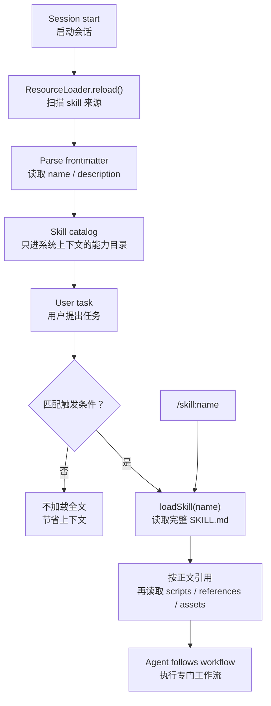

# s05 Skills

## 本章要解决的问题

当 agent 越来越像一个工作台时，光靠一份系统提示词会遇到一个很现实的问题：能力很多，但每次任务只需要其中一小部分。

如果把所有工作流、脚本说明、API 参考、审稿标准、设计规范都塞进常驻上下文，模型会变慢、变贵，也更容易被无关信息带偏。

Skill 要解决的是“按需能力加载”：启动时只让模型看见能力目录；任务真的匹配时，再加载完整说明和资源。

一句话说：

```text
prompt template 是一次性展开的任务话术。
skill 是可被发现、可被触发、可按需展开的能力包。
```

本章会把 skill 拆成四件事：skill catalog、frontmatter、progressive disclosure、ResourceLoader。

## 为什么上一章不够

上一章 `s04_prompt_templates` 解决的是“重复 prompt 怎么变成 `/review` 这样的入口”。

这对轻量任务很好，但它不够处理三类场景：

- 工作流长：例如代码审查要先看 diff，再看测试，再按严重程度输出。
- 资料多：例如 PDF、文档、会议纪要、设计规范，不该全部常驻。
- 执行有配套资源：例如脚本、模板、参考文档、样例资产，需要相对路径加载。
- 触发需要语义判断：用户可能没有输入 `/review`，但说“帮我严查这个 PR”，agent 也该知道可用 review skill。

所以 prompt template 更像“可复用按钮”，skill 更像“可按需打开的工具说明书 + 资料夹”。

## Mermaid 图示



这张图里有两个关键边界：

- catalog 是常驻的，应该短。
- SKILL.md 正文和资源是按需的，可以更具体。

## 机制拆解

1. discovery：从多个 skill 来源扫描候选文件。
2. frontmatter parsing：只解析 `SKILL.md` 顶部元数据，尤其是 `name` 和 `description`。
3. validation：缺少关键字段的 skill 应跳过或报警；轻微格式问题可以给 warning。
4. catalog building：把可见 skill 的 `name` 和 `description` 放进系统上下文。
5. trigger decision：模型根据用户任务和 description 判断是否需要加载 skill。
6. activation：匹配后读取完整 `SKILL.md`，并按正文继续读取相对资源。
7. lifecycle：修改 skill 后需要 reload，才能让当前会话重新发现资源。

这里的触发条件不是一个固定关键词规则。真实 harness 通常让模型读 description 后自己判断；显式命令 `/skill:name` 则绕过猜测，强制加载。

## Skill Catalog

Skill catalog 是系统提示词里那一小段“可用能力列表”。

它不应该包含完整教程，只需要回答两个问题：

| 字段 | 作用 |
|---|---|
| `name` | 稳定标识，便于 `/skill:name` 或内部引用 |
| `description` | 告诉模型这个 skill 做什么、什么时候用 |
| `source` | 诊断用，帮助人知道它来自全局、项目、package 还是 settings |

一个好的 catalog 项大概长这样：

```xml
<skill name="repo-review">
  <description>Reviews a repository change for correctness, safety, test coverage, and product clarity. Use when asked to inspect local changes or review a PR-sized patch.</description>
</skill>
```

注意：description 不是营销文案，而是触发条件。

## Frontmatter

`SKILL.md` 的顶部 frontmatter 是给 harness 和模型看的“封面信息”。

最小结构：

```markdown
---
name: repo-review
description: Reviews a repository change for correctness, safety, test coverage, and product clarity. Use when asked to inspect local changes.
---

# Repo Review

## Workflow

1. Inspect the current diff.
2. Report findings first.
```

教学上先记住两个必填项：

- `name`：短、稳定、可命令调用。
- `description`：具体说明能力范围和触发场景。

description 写得越泛，模型越难判断；写得越像“Use when...”，越容易触发正确。

## Progressive Disclosure

Progressive disclosure 的意思是“渐进披露”。

在 skill 里，它通常分三层：

| 层级 | 加载内容 | 何时加载 | 成本 |
|---|---|---|---|
| Catalog | name + description | 会话启动 | 低 |
| Instructions | 完整 `SKILL.md` | skill 被触发 | 中 |
| Resources | scripts / references / assets | 正文引用时 | 不固定 |

这不是为了省一点点字，而是为了守住 agent 产品的可控性：

- 常驻上下文越短，模型越不容易被噪音干扰。
- 专门任务被触发后，模型又能拿到足够详细的工作流。
- 资源文件可以继续按需读取，不必一次性全塞进去。

## ResourceLoader

在真实 Pi 的 SDK 语境里，`ResourceLoader` 是给会话供应资源的入口；它可以供应 extensions、skills、prompt templates、themes 和 context files。

本章代码把它简化成一个 `MockResourceLoader`，只负责 skills：

- `reload()`：重新扫描所有 skill roots。
- `getCatalog()`：返回只含 description 的系统目录。
- `loadSkill(name)`：按名称读取完整 `SKILL.md`。
- `listResources(name)`：展示 skill 文件夹下还有哪些脚本或参考资料。

这不是声明 Pi 内部源码就长这样，而是用一个小模型帮助你理解产品机制。

## 触发条件

触发有两种路径：

| 路径 | 例子 | 产品含义 |
|---|---|---|
| 显式触发 | `/skill:repo-review staged diff` | 用户明确指定，不靠模型猜 |
| 模型触发 | “帮我严查这个 PR” | 模型根据 description 判断要不要加载 |

因此 description 应该写清三件事：

- 这个 skill 能产出什么。
- 它适合哪些输入或任务。
- 它不适合替代哪些更高优先级规则。

不要写 `description: Helps with docs.` 这种万能话；更好的写法是明确输入、产出和触发，例如“Use when asked to turn notes into PRDs, release notes, or structured decision memos.”

## 代码导读

本章的 [code.mjs](code.mjs) 是一个无依赖 mock skill registry。

它演示六个能力：

- 扫描多个来源：全局 Pi skills、全局 `.agents/skills`、项目 `.pi/skills`、项目 `.agents/skills`、package skills、settings 指定目录。
- 解析 frontmatter：提取 `name`、`description`、`license`、`disable-model-invocation` 等字段。
- 生成 system catalog：只放可见 skill 的 name 和 description。
- 处理冲突：同名 skill 只保留扫描顺序中的第一个，并输出 warning。
- `loadSkill(name)`：被触发时再读取完整 `SKILL.md`。
- 对比 token 成本：catalog 和全文加载的成本差异。

运行：

```bash
node s05_skills/code.mjs
```

你会看到 discovery、catalog、trigger simulation、loadSkill、progressive disclosure cost 几段输出。

## 对应真实 Pi

截至 2026-05-28，已核验的官方事实如下：

- Pi Skills 是按需加载的自包含能力包，可以包含工作流、设置说明、脚本和参考资料。
- Pi 会从全局、项目、package、settings、CLI `--skill` 等来源加载 skills。
- 项目级来源包括 `.pi/skills/` 和 `.agents/skills/`；`.agents/skills/` 会沿 `cwd` 和父目录查找。
- Pi 启动时扫描 skill 位置，提取 name 和 description，放入系统提示词 catalog。
- 当任务匹配时，agent 会读取完整 `SKILL.md`；`/skill:name` 可以显式触发。
- `SKILL.md` frontmatter 至少需要 `name` 和 `description`；`description` 缺失时不会加载。
- 可选字段包括 `license`、`compatibility`、`metadata`、`allowed-tools`、`disable-model-invocation`。
- 同名 skill 冲突时，Pi 会 warning，并保留第一个发现的 skill。
- SDK 的 `createAgentSession()` 默认使用 `DefaultResourceLoader`；自定义 `ResourceLoader` 后，资源发现逻辑由你接管。

官方入口：

- [Pi Skills](https://pi.dev/docs/latest/skills)
- [Pi SDK](https://pi.dev/docs/latest/sdk)

## 教学简化 vs 生产差异

| 主题 | 本章 demo | 真实 Pi / 生产系统 |
|---|---|---|
| 文件系统 | 用内存 Map 加一份真实 repo skill | 真实扫描磁盘、settings、package 和 CLI 输入 |
| Frontmatter | 手写轻量解析器 | 生产应使用健壮 YAML 解析与诊断 |
| 触发判断 | 用简单关键词模拟 | 真实主要由模型读 description 后判断 |
| ResourceLoader | 只实现 skills | Pi 的 ResourceLoader 还供应 prompts、extensions、themes、context files |
| Token 估算 | 粗略字符估算 | 真实 token 取决于 provider tokenizer |
| 权限 | 只展示字段 | 生产还要结合权限系统、工具 allowlist、来源信任和审计 |
| 资源读取 | 只列出相对资源 | 真实 agent 会按正文需要读取具体文件或运行脚本 |

不要从 demo 推导“Pi 内部就是关键词匹配”。

应该学到的是产品结构：先发现、再披露、后加载，资源越重越晚进入上下文。

## 练习

1. 给 demo 增加一个 `data-analysis` skill，并让 description 明确写出 “Use when...”。
2. 把某个 skill 的 description 改得很泛，观察 trigger simulation 是否更难判断。
3. 增加一个同名 skill，观察冲突 warning，并思考真实团队应该如何避免命名冲突。
4. 给一个 skill 加上 `disable-model-invocation: true`，解释为什么它不会进 system catalog。
5. 把正文里的一段长参考资料移到 `references/`，只在 `SKILL.md` 里保留路径指针。
6. 为你团队写一个 code review skill，要求 description 同时说明输入、输出和触发场景。

## 事实核验清单

写 skills 相关内容时，至少核验这些点：

- Pi 官方文档入口是否仍是 `https://pi.dev/docs/latest`。
- skills 来源路径是否仍包含 `.pi/skills/`、`.agents/skills/`、`~/.pi/agent/skills/`、`~/.agents/skills/`。
- package skills 和 `pi.skills` package manifest 是否仍受支持。
- CLI `--skill`、`--no-skills` 和 `/skill:name` 的行为是否变化。
- `SKILL.md` frontmatter 必填字段和可选字段是否变化。
- `description` 缺失是否仍会导致 skill 不加载。
- 同名 skill 冲突策略是否仍是 warning 并保留第一个。
- SDK 是否仍通过 `ResourceLoader` / `DefaultResourceLoader` 供应 skills。
- 是否把教学 demo 的关键词触发误写成 Pi 官方实现。
- 是否把 skill 当成权限系统；skill 只能指导行为，不能替代 sandbox 和审批。

本章底线：Skill 不是更长的 prompt，而是可发现、可触发、可按需展开的能力包。
