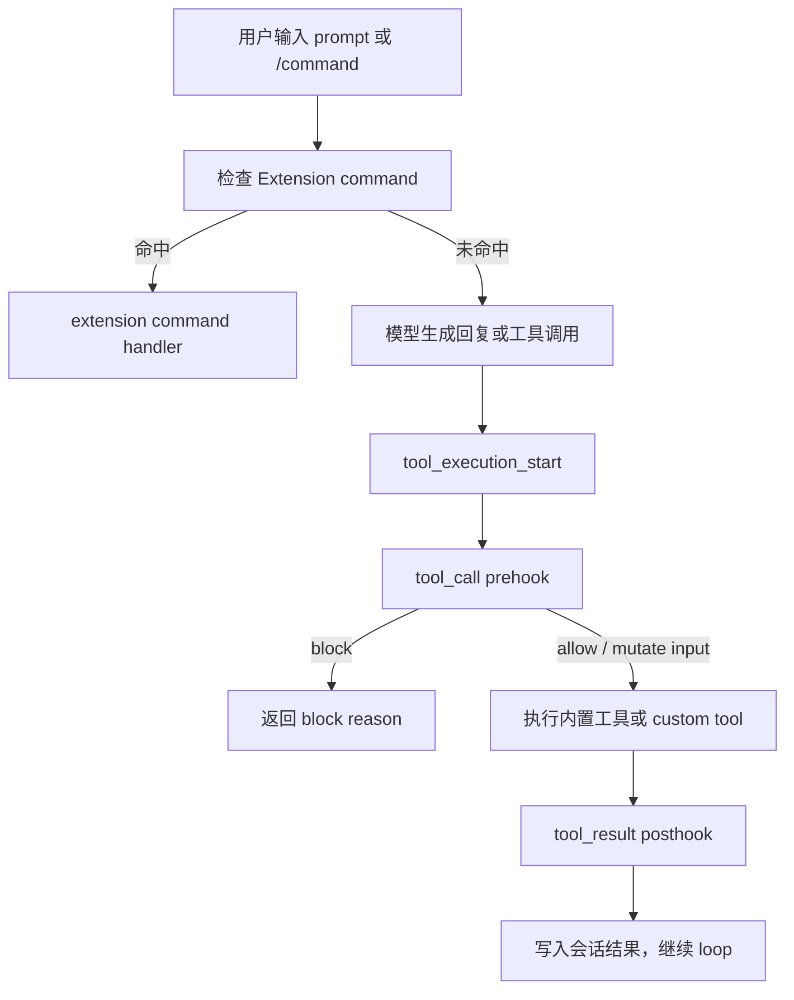

# s06 Extensions

## 本章要解决的问题

前几章讲的是 agent harness 的内层能力：loop、tool dispatch、context、prompt template、skill。
这一章处理更靠近“平台机制”的问题：当你不只是想提示模型，而是想改变 Pi 的运行时行为，应该怎么做？

典型需求包括：
- 在 bash 执行危险命令前强制弹确认。
- 给模型增加一个项目专属工具。
- 增加一个 `/safety` 这样的 slash command。
- 在工具调用前后做审计、拦截、补充 details。
- 把团队安全策略变成运行时规则，而不是写在提示词里的建议。

本章答案是：用 Extension，它是挂在 agent loop 周边的 TypeScript 扩展点，能注册 event hook、custom tool、custom command，也能通过 `ctx.ui` 与用户交互。

## 为什么上一章不够

s05 的 Skill 适合封装“用到时再加载”的领域工作流。
例如：代码评审 skill 可以写规则、步骤、脚本和参考资料。
但 Skill 的能力边界也很明确：
- Skill 主要影响模型读取到的知识和流程。
- Skill 不适合保证每一次工具调用都经过检查。
- Skill 不适合注册底层新工具。
- Skill 不适合实现真正的 slash command handler。
- Skill 不适合做必须发生的安全门禁。

你可以在 skill 里写：“执行 `rm -rf` 前必须问用户。”
但这仍然依赖模型遵守。
如果你要的是系统机制：只要 bash 工具将执行 `rm -rf`，就必须经过 `ctx.ui.confirm`，那就应该用 Extension。

一句话区分：Skill 是“让模型知道怎么做”，Extension 是“让 harness 真的这样运行”。

## Mermaid 图示



这张图只画本章最重要的路径，产品上先抓三件事：
1. 命令入口：用户输入 `/xxx` 时，是否由扩展直接处理。
2. 工具前置：工具执行前，扩展能否拦截、修改或阻止。
3. 工具后置：工具执行后，扩展能否补充结果或记录审计。

## 机制拆解

### ExtensionAPI

真实 Pi 扩展通常是一个默认导出的 TypeScript 函数，入口类型是 `ExtensionAPI`。
本章代码为了讲清机制，把注册工具和命令写成 `registerTool` / `registerCommand` 这样的教学 mock 名称；真实 Pi 的具体方法名、参数和返回值以官方 Extensions 文档为准。

```ts
import type { ExtensionAPI } from "@earendil-works/pi-coding-agent";

export default function myExtension(pi: ExtensionAPI) {
  pi.on("tool_call", async (event, ctx) => {});
  // Teaching mock names. Check Pi docs before writing production extensions.
  pi.registerTool({ name: "my_tool", /* ... */ });
  pi.registerCommand("hello", { handler: async (args, ctx) => {} });
}
```

这里的 `pi` 不是模型，而是 Pi harness 给扩展的控制面。
常见能力可以按四类理解：
- 事件：通过 extension 订阅 lifecycle events，本章 mock 表达为 `pi.on(eventName, handler)`。
- 工具：通过 extension 暴露 custom tools，本章 mock 表达为 `pi.registerTool(definition)`。
- 命令：通过 extension 暴露 custom commands，本章 mock 表达为 `pi.registerCommand(name, definition)`。
- UI / 上下文：`ctx.ui.confirm`、`ctx.ui.notify`、`ctx.cwd`、`ctx.sessionManager`。

重要权衡：Extension 是代码，拥有本机执行权限。
它比 prompt 和 skill 更强，也更危险。
所以 Extension 应该小、清晰、可审计。

## Event Hook 拆解

Event hook 是 Pi 在生命周期关键点发出的事件。
扩展监听后，可以观察、修改，或返回控制结果。

本章代码重点模拟两个事件：
- `tool_call`：工具执行前触发，是 prehook。
- `tool_result`：工具执行后触发，是 posthook。

`tool_call` 适合做：
- 危险命令拦截。
- 参数补全或改写。
- 项目路径保护。
- 权限判断。
- 高风险动作审批。

`tool_result` 适合做：
- 给结果追加审计 details。
- 清洗过长或敏感输出。
- 标记错误类型。
- 把工具结果摘要写入状态。
- 为自定义 UI 渲染补充信息。

策略上通常分三层：
- 明确禁止：直接 block。
- 高风险：弹确认或走审批。
- 低风险：允许，但记录日志。

## Custom Tool 拆解

Custom tool 是扩展注册给模型调用的新工具。
它不是普通函数，因为它会进入 agent 的工具协议：
- 有名称、描述和参数 schema。
- 会出现在模型可用工具列表中。
- 返回值会进入会话上下文。
- 需要控制输出长度，避免污染上下文。

本章代码里的 `project_note` 是教学版 custom tool。
它接收 `text`，返回一条项目笔记。

真实生产里，custom tool 可能连接内部工单系统、代码搜索服务、只读数据库查询、Feature flag 平台或公司审批流。
产品判断标准：如果只是补充知识，用 skill；如果模型需要执行一个动作，用 custom tool。

## Custom Command 拆解

Custom command 是面向用户的 slash command，例如 `/safety`。
它和 prompt template 不一样：
- prompt template 通常展开成一段提示词。
- custom command 可以直接执行代码并改变 runtime 状态。
- custom command 可以调用 UI、触发 reload、展示状态。

适合做 custom command 的场景：
- 查看扩展状态。
- 切换安全模式。
- 打开自定义 UI。
- 触发固定项目流程。
- 汇总当前 session 信息。

## `.pi/extensions/protect-dangerous.ts` 拆解

本仓库有一个真实形态示例：
[`.pi/extensions/protect-dangerous.ts`](../.pi/extensions/protect-dangerous.ts)。

它的逻辑很短，但代表了 Extension 的典型价值：
1. 导入 `ExtensionAPI` 类型。
2. 默认导出 `protectDangerous(pi)`。
3. 监听 `pi.on("tool_call", ...)`。
4. 只处理 `event.toolName === "bash"`。
5. 读取 `event.input.command`。
6. 用正则匹配 `rm -rf`、`sudo`、写入 `.env`。
7. 安全命令直接放行。
8. 危险命令调用 `ctx.ui.confirm(...)`。
9. 用户拒绝时返回 `{ block: true, reason: ... }`。

重点不是“模型被提醒了”。
重点是 bash 工具真正执行前，被 harness 机制拦住了。

## 代码导读

运行：

```bash
node s06_extensions/code.mjs
```

本章代码实现了一个 mock extension runtime：
- `MockPiRuntime`：教学版 Pi 扩展宿主。
- `registerTool`：注册 custom tool。
- `registerCommand`：注册 slash command。
- `on` / `emit`：注册并触发生命周期事件。
- `ctx.ui.confirm`：模拟用户确认弹窗。
- `tool_call`：执行工具前的 prehook。
- `tool_result`：执行工具后的 posthook。

示例扩展 `protectDangerousExtension` 做四件事：
1. 注册 `/safety` 命令，展示保护规则。
2. 注册 `project_note` 工具，模拟项目自定义动作。
3. 在 `tool_call` 阶段拦截危险 bash。
4. 在 `tool_result` 阶段追加审计 details。

主流程演示三类调用：
- `npm test`：安全 bash，允许执行。
- `rm -rf node_modules`：危险 bash，触发确认并被拒绝。
- `project_note`：custom tool，被模型正常调用。

## 对应真实 Pi

截至 2026-05-28，本章按官方资料核验：
- Pi 是 terminal coding harness，可通过 TypeScript extensions、skills、prompt templates、themes、packages 扩展。
- 当前官方仓库是 `earendil-works/pi`。
- 当前 CLI 包名是 `@earendil-works/pi-coding-agent`。
- 官方 Extension 文档使用 `ExtensionAPI` 作为扩展入口类型。
- 项目级扩展路径包括 `.pi/extensions/*.ts` 和 `.pi/extensions/*/index.ts`。
- 官方 Extensions 文档覆盖 lifecycle events、custom tools、custom commands 和 `ctx.ui` 交互；具体 API 名称与签名以官方文档为准。
- `tool_call` 在工具执行前触发，可以 block 或修改 input。
- `tool_result` 在工具执行后触发，可以修改结果。

参考：
- [Pi Documentation](https://pi.dev/docs/latest)
- [Pi Extensions](https://pi.dev/docs/latest/extensions)
- [Pi moved to Earendil Works](https://pi.dev/news/2026/5/7/pi-has-a-new-home)

## 教学简化 vs 生产差异

本章代码是教学 mock，不是 Pi 源码复制。

主要简化：
- 参数 schema 用普通对象模拟，没有接入 TypeBox。
- 只内置 `bash`，没有完整工具集。
- 只演示 `tool_call` 和 `tool_result`。
- `ctx.ui.confirm` 用预设策略模拟，没有真实 TUI/RPC UI。
- bash 没有真正执行 shell，只返回模拟结果。
- 会话状态只存在内存，没有 session 文件和 branch 恢复。
- 没有并行工具调用、AbortSignal 取消、流式 update、自定义渲染器。

生产扩展还要考虑：
- 扩展本身的权限边界。
- 多个扩展的加载顺序。
- hook 链式修改造成的副作用。
- 输出截断和上下文污染。
- 无 UI 模式下确认框如何降级。
- session fork、compact、resume 后状态如何恢复。

## 练习

1. 增加规则：bash 命令包含 `curl ... | sh` 时必须确认。
2. 把 `project_note` 增加 `kind` 参数：`decision`、`risk`、`todo`。
3. 新增 `/tools` command，打印当前注册的工具。
4. 在 `tool_result` 中统计每个工具调用次数。
5. 设计一张策略表：哪些动作直接 block，哪些弹确认，哪些只记录。

## 事实核验清单

写真实 Pi 扩展前，至少核验：
- 官方仓库是否仍是 `earendil-works/pi`。
- npm 包名是否仍是 `@earendil-works/pi-coding-agent`。
- `ExtensionAPI` 的导入路径是否变化。
- `.pi/extensions/*.ts` 是否仍支持项目级自动发现。
- `pi -e ./path.ts` 或 `--extension` 的加载方式是否变化。
- `tool_call` 返回 `{ block: true, reason }` 的语义是否变化。
- `tool_result` 可修改字段是否变化。
- `ctx.ui.confirm` 在 interactive、print、JSON、RPC 模式下表现是否一致。
- custom tool 的 `execute` 签名是否变化。
- custom command 的 `handler` 参数是否变化。

## 小结

Skill 解决“让模型知道一套工作流”。
Extension 解决“让 harness 多一种机制”。
当需求涉及强制拦截、真实动作、运行时状态或项目级自动化时，就应该优先考虑 Extension。
