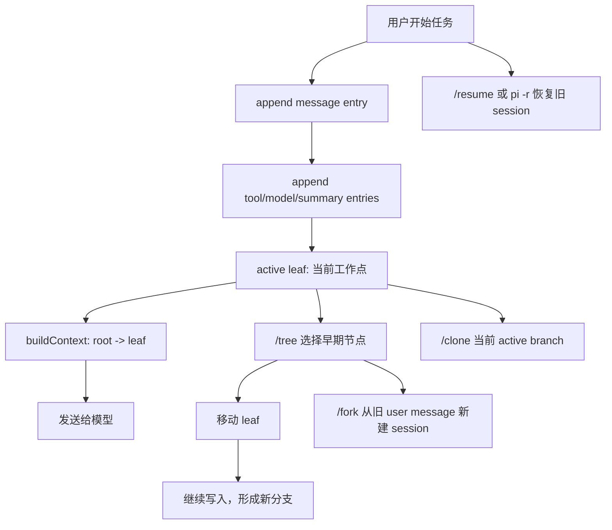

# s07 Sessions

## 本章要解决的问题
Coding agent 为什么不能只保存一段线性聊天记录？
因为真实工作不是直线：你会让 agent 先试一个方案，发现测试失败，再回到早一点的位置改走另一条路。你也可能想把当前进展复制一份，继续做高风险实验，但保留原来的稳定路径。
这时需要的不是“聊天历史”，而是 session tree。
本章把 session 拆成四个产品问题：
- 如何把每轮对话、工具结果、模型切换写成可恢复的记录？
- 如何表达“从旧节点继续”的分支，而不是覆盖旧历史？
- 如何知道当前上下文应该从哪条分支重建？
- 如何区分 resume、fork、clone 这些看起来相似的入口？

学完后，你应该能把 session 看成 agent harness 的状态层：它既服务用户体验，也服务调试、审计、回滚和成本追踪。

## 为什么上一章不够
s06 讲的是 Extension：怎样在 agent loop 周边增加工具、命令、hook 和安全策略。
但 Extension 只回答“运行时可以发生什么”。它没有完整回答“发生过什么、当前在哪、下一轮模型应该看到什么”。
举个例子：
- Extension 可以拦截一次危险 bash；session 才能记录这次拦截发生在哪个分支。
- Extension 可以注册 `/safety` 命令；session 才能让用户明天 `/resume` 回来继续同一条工作线。
- Extension 可以参与模型切换；session 才能记录“这条分支后来换成了另一个 provider/model”。

所以 s07 的重点不是再加一个工具，而是理解 harness 的记忆结构。

## Mermaid 图示



这张图里最重要的词是 leaf。leaf 不是“最后一行文件”，而是“用户当前选择继续的位置”。只要 leaf 变了，下一轮模型看到的上下文就会变。

## 机制拆解

### Session 不是普通日志
普通日志通常回答：系统按时间发生了什么？
Session 还要回答：用户现在选择哪条历史作为上下文？
这带来三个差异：
- 日志是线性的，session 可以是树。
- 日志主要给人看，session 还要喂给模型。
- 日志只追加事实，session 还需要表达分支、摘要、标签和模型状态。

所以 session 是产品状态，不只是文件格式。

### JSONL：为什么一行一个 JSON
Pi 的 session 文件使用 JSONL，也就是 JSON Lines。
教学上可以把它理解成：
- 第一行是 session header。
- 后面每一行是一条 entry。
- 每条 entry 都有 `type`。
- 多数 entry 都有 `id` 和 `parentId`。
- 用 `parentId` 串起来，就能从任意 leaf 走回 root。

JSONL 的好处很直接：追加写入简单，崩溃后容易恢复到已写入的最后一行，工具和扩展也可以逐行解析。代价是读取时需要重建索引、检查 `parentId`，并处理旧版本迁移。

### Entry 类型
真实 Pi 的 session entry 不只保存用户和助手消息。
本章为了讲清 session tree，重点关注几类教学上最有解释力的状态切片：
- `session`：文件头，记录版本、session id、cwd 等元信息。
- `message`：用户、助手、工具结果等对话内容。
- `model_change`：中途切换 provider/model。
- `compaction`：把较早上下文压缩成摘要。
- `branch_summary`：从一条分支切到另一条分支时，保存被离开分支的摘要。
- 扩展状态、标签、session 信息等其他 entry：真实 Pi 可能用不同类型和字段表达，完整枚举以官方 Session Format 文档为准。

产品上不要把这些都理解成“聊天气泡”。更准确的理解是：它们都是恢复 agent 工作现场需要的状态切片；本章列表是教学切片，不是 Pi session-format 的完整字段表。

### Session Tree

Session tree 的核心字段只有两个：
- `id`：这条 entry 自己是谁。
- `parentId`：这条 entry 接在哪条 entry 后面。

一个最小树长这样：

```text
user: 重构支付模块
└─ assistant: 方案 A，直接拆 service
   ├─ assistant: 方案 A 失败
   └─ branch_summary: 方案 A 的经验
      └─ model_change: 切到另一个模型
         └─ user: 改走方案 B
            └─ assistant: 方案 B 通过
```

同一个父节点下面可以有多个孩子。这就是分支。

### Leaf：当前上下文的锚点

leaf 是当前工作点。`buildContext()` 会从 leaf 往上找父节点，一直找到 root，然后按 root 到 leaf 的顺序还原消息。

如果 leaf 指向“方案 A 失败”，模型会看到方案 A 的路径。如果 leaf 指向“方案 B 通过”，模型会看到方案 B 的路径。

这就是为什么 session tree 比线性日志更适合 agent：用户不是只能“继续最后一条记录”，而是可以选择“从某个历史节点继续”。

### Fork、Clone、Resume 的区别

这几个词容易混，可以按“是否新建 session 文件”和“复制哪段历史”来区分。

`resume`：
- 打开一个已经存在的 session。
- 目标是继续旧工作。
- 典型入口是 `/resume` 或启动时选择最近 session。

`/tree`：
- 仍在同一个 session 文件里。
- 目标是浏览树，并把 leaf 移到某个旧节点。
- 继续输入后，会在同一个文件里长出新分支。

`/fork`：
- 从一个旧 user message 附近新建 session。
- 目标是把某个早期想法拿出去单独做。
- 输出是新 session 文件。

`/clone`：
- 复制当前 active branch 到新 session。
- 目标是保留当前工作，再开一个独立副本继续试验。
- 输出也是新 session 文件。

一句话：`/tree` 是同文件内换 leaf，`/fork` 是从早期提示开新文件，`/clone` 是复制当前分支开新文件。

### Context Reconstruction

模型每一轮不应该直接读“整个 session 文件”。它应该读“从当前 leaf 回到 root 的有效上下文”。

一个简化版 `buildContext()` 会做四步：
1. 建立 `id -> entry` 索引。
2. 从 leaf 通过 `parentId` 一路回到 root。
3. 反转路径，得到 root 到 leaf 的顺序。
4. 把 message、branch summary、compaction、model change 转成下一轮模型需要的输入。

这一步是 session 的灵魂。没有它，分支只是漂亮的树；有了它，agent 才知道“现在应该基于哪条历史继续工作”。

## 代码导读

运行：

```bash
node s07_sessions/code.mjs
```

本章代码实现了一个小型 `SessionManager` mock。它故意保持无外部依赖，只演示核心机制：
- `appendMessage(role, content)`：追加用户或助手消息。
- `appendModelChange(provider, modelId)`：记录中途模型切换。
- `branch(entryId)`：把 active leaf 移到旧 entry。
- `appendBranchSummary(fromId, summary)`：模拟切换分支时留下摘要。
- `buildContext()`：从当前 leaf 重建下一轮模型上下文。
- `cloneActiveBranch()`：复制当前分支到一个新 session。
- `toJSONL()`：打印一行一个 JSON 的 session 文件形态。
- `SessionManager.fromJSONL()`：模拟 resume，从 JSONL 恢复内存对象。

主流程故意构造了一个失败分支和一个成功分支：
1. 用户要求重构支付模块。
2. agent 先走方案 A。
3. 方案 A 暴露边界问题。
4. 用户回到 root。
5. session 写入 branch summary。
6. 切换模型。
7. 改走方案 B。
8. 重建当前 leaf 的上下文。
9. clone 当前分支。
10. 打印 JSONL 并模拟 resume。

读代码时建议重点看两处：`getBranch()` 怎样从 leaf 往 root 走；`buildContext()` 怎样把树路径变成模型消息列表。

## 对应真实 Pi

截至 2026-05-28，本章按官方 Pi 文档核验：
- Pi 会把 conversation 保存为 sessions，用于继续工作、从早期回合分支、回看旧路径。
- Session 默认保存到 `~/.pi/agent/sessions/`，并按工作目录组织。
- Session 文件是 JSONL。
- Session entry 通过 `id` / `parentId` 形成树结构。
- 当前工作点被称为 active leaf。
- `/resume` 用于选择并恢复旧 session。
- `/new` 用于开始新 session。
- `/tree` 用于在当前 session tree 中导航。
- `/fork` 用于从之前的 user message 创建新 session。
- `/clone` 用于把当前 active branch 复制成新 session。
- Session format 文档列出了 `message`、`model_change`、`compaction`、`branch_summary` 等 entry；完整 entry 枚举和字段以官方文档当前版本为准。
- SessionManager API 包括 `create`、`open`、`continueRecent`、`list`、`appendMessage`、`appendModelChange`、`branch`、`getBranch`、`buildSessionContext` 等方法。

参考：
- [Pi Sessions](https://pi.dev/docs/latest/sessions)
- [Pi Session File Format](https://pi.dev/docs/latest/session-format)

## 教学简化 vs 生产差异

本章代码是教学 mock，不是 Pi 源码复制。

主要简化：
- id 用 `e001` 这种递增字符串，真实 Pi 文档示例是短十六进制 id。
- timestamp 是确定性时间，方便教材输出稳定。
- 只实现少量 entry 类型。
- message content 简化为字符串。
- `buildContext()` 没有完整处理工具调用、图片、thinking、usage、cost。
- `branch_summary` 只转成一条教学消息。
- `cloneActiveBranch()` 只复制 active branch，不处理真实文件路径、权限和 session picker。
- `fromJSONL()` 默认把最后一条 entry 当 leaf。
- 没有实现 compaction 的 token 截断和 `firstKeptEntryId` 逻辑。
- 没有实现 label、session name、extension state、删除和 trash CLI。

生产系统还要额外考虑：session 文件写入原子性、多进程冲突、损坏 JSONL 恢复、旧版本迁移、路径脱敏、分享导出边界、分支摘要遗漏、compact 后的任务连续性，以及 extension 注入 entry 的安全解析。

## 练习

1. 给 `SessionManager` 增加 `appendCompaction(summary, firstKeptEntryId, tokensBefore)`。
2. 修改 `buildContext()`，让它遇到 compaction 后只保留摘要和 `firstKeptEntryId` 之后的消息。
3. 给 entry 增加 `label`，并实现 `getLabel(id)`。
4. 修改 `cloneActiveBranch()`，打印新旧 id 的映射表。
5. 增加一个 `forkFrom(entryId)`，只从某个 user message 生成新 session。
6. 写一个校验器，检查每个非空 `parentId` 是否都存在。
7. 故意删掉一条中间 entry，观察 `getBranch()` 应该怎样报错。
8. 设计一个产品 UI：用户在 `/tree` 里怎样看出当前 leaf、分支摘要和模型切换点？

## 事实核验清单

写真实 Pi session 相关代码前，至少核验：
- 官方 session 文档里 session 目录是否仍是 `~/.pi/agent/sessions/`。
- Session format 当前版本号是否仍是 v3。
- entry 的 `type` 名称是否变化。
- `id` / `parentId` 的字段语义是否变化。
- `/resume`、`/tree`、`/fork`、`/clone` 的用户语义是否变化。
- `SessionManager.create()`、`open()`、`continueRecent()`、`list()` 的签名是否变化。
- `appendMessage()`、`appendModelChange()`、`branch()` 的返回值和副作用是否变化。
- `buildSessionContext()` 对 compaction 和 branch summary 的处理是否变化。
- session 分享、导出、删除是否有新的权限或隐私约束。
- 与 extension、model switching、compaction 相关的 entry 是否新增字段。

## 小结

Session 是 agent 产品的记忆层。线性历史只能让 agent “继续最后一步”；session tree 让用户可以恢复、分支、复制、回看和重建上下文。

当你设计一个 coding agent 时，session 不是收尾功能。它决定了用户是否敢让 agent 做长任务、试错、回滚和复盘。
