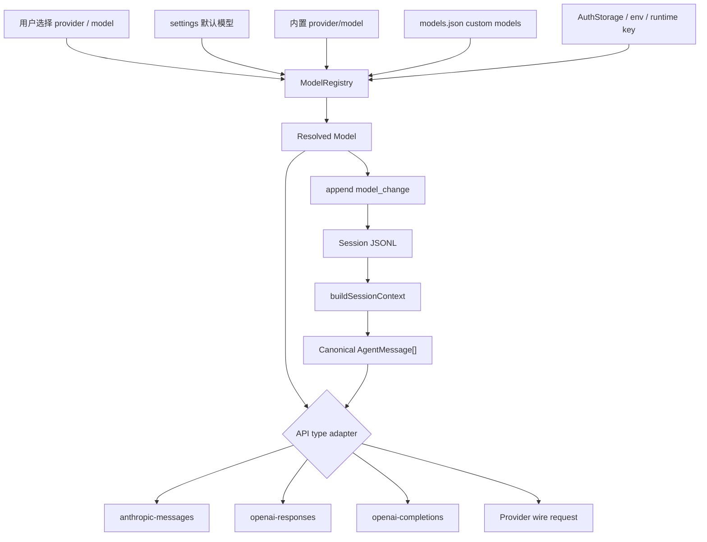

# s08 Models

## 本章要解决的问题

多模型支持真的只是换一个 API endpoint 吗？

不是。对用户来说，模型切换像一个下拉框：Claude、GPT、本地模型、公司网关，选完继续聊。但对 agent harness 来说，模型切换会影响 provider、model、API type、auth、消息格式、工具协议、reasoning 参数、缓存语义和 session 恢复。

本章要解决的问题是：如何把“选模型”设计成一套可诊断、可恢复、可扩展的产品机制，而不是散落在 UI 和 prompt 里的临时配置。

你学完应该能解释 provider、model、API type、auth、ModelRegistry、canonical message、provider adapter、custom models、compat flags 和 `model_change` 各自解决什么问题。

## 为什么上一章不够

s07 讲 session tree，解决的是“任务历史如何保存、分叉、恢复”。它让 agent 记得发生过什么。

但它没有回答：同一段 session 历史，能不能交给另一个 provider 继续跑？

这就是 s08 的问题。

如果只有 `messages[]`，切模型时会马上遇到这些坑：
- Anthropic 和 OpenAI 对 tool call 的 wire format 不一样。
- 有的模型支持工具，有的模型完全不支持工具。
- 有的 provider 支持 reasoning effort，有的只接受普通文本。
- 本地模型或公司代理可能只“长得像 OpenAI”，但只支持部分字段。
- session 中途换过模型，恢复时必须知道当前 leaf 应该用哪个模型。

所以 session 负责保存历史，model layer 负责让这段历史能被正确送给某个模型。简化说：s07 管“发生过什么”，s08 管“现在该用谁、怎么说话”。

## Mermaid 图示



这张图不是 Pi 源码调用图，而是产品机制图。重点是四层：
- 选择层：用户、默认配置、恢复 session 都可能决定模型。
- 注册层：内置模型、custom models、认证状态汇总成 registry。
- 适配层：统一消息转换成 provider 能接受的请求。
- 记录层：模型变化写回 session，保证恢复和复盘。

## 机制拆解

### 1. Provider、Model、API type

这三个词不要混在一起。

Provider 是“谁提供服务”，例如 `anthropic`、`openai`、`google`、`openrouter`、`local-openai`、公司内部代理。

Model 是“具体用哪个能力包”，例如 `claude-sonnet-4-6`、`gpt-5.1`、`qwen2.5-coder:7b` 或某个公司内部部署名。

API type 是“走哪种协议”，例如 `anthropic-messages`、`openai-responses`、`openai-completions`、`google-generative-ai`。本章代码只演示前三类 adapter；Google adapter 只作为真实 Pi 支持面的概念位置出现。

同一个 provider 可以有多个 model。同一个 API type 也可以被多个 provider 复用。例如本地 vLLM、Ollama、LM Studio、公司代理，经常暴露 OpenAI-compatible 接口，但它们不是 OpenAI provider。

产品上最容易踩坑的是：只保存 model name，没有保存 provider 和 API type。更稳的结构是：`provider + modelId + api + compat` 一起进入 registry。

### 2. Auth 不属于 prompt

模型认证不是让模型“知道 API key”。认证属于 harness 的控制面。

常见来源包括 OAuth token、`auth.json`（路径：`~/.pi/agent/auth.json`，权限 0600，packages/coding-agent/src/core/auth-storage.ts:69）、环境变量、SDK 运行时临时 key，以及 custom provider 在 `models.json` 中声明的 key。解析优先级：CLI `--api-key` > `auth.json` api_key > `auth.json` OAuth（自动刷新）> 环境变量 > `models.json` fallback（packages/coding-agent/src/core/auth-storage.ts:455）。

这些信息不应该进入 prompt，也不应该进入 LLM context。模型只需要看到任务上下文；harness 才需要知道怎么鉴权、怎么隐藏密钥、怎么调用 provider。

本章代码里的 `AuthStore` 只演示解析优先级和脱敏输出，不读真实文件，也不调用真实 API。

### 3. ModelRegistry 是产品边界

`ModelRegistry` 的价值不是“放一个数组”。它把内置 provider/model、用户定义的 custom models、当前认证状态收口起来。

因此它能回答三类问题：`find(query)` 按 id/名称检索模型，`list()` 列出所有已注册模型，`getProvider(providerId)` 获取 provider 配置，`compat` 告诉 adapter 调用时要避开哪些字段(packages/coding-agent/src/core/model-registry.ts:35)。

没有 registry，模型选择会散落到 UI、配置、session 恢复、SDK 参数里。结果通常是：界面能选但调用失败，session 恢复后找不到模型，custom model 覆盖了内置模型却没人知道。

### 4. Canonical message 是内部契约

多 provider harness 通常需要一个内部消息格式。它不是任何一家 provider 的原始协议，而是 agent runtime 自己认可的“标准语言”。

本章代码用简化版 canonical message：`system` 放系统提示，`user` 放用户输入，`assistant` 放助手文本和 tool call，`tool` 放工具结果，`content[]` 统一放 text、tool_call 等 block。

真实产品中还会有图片、文件引用、thinking block、usage、stop reason、streaming delta 等。核心思想不变：session 保存内部格式，adapter 负责转换到外部格式。

### 5. Provider adapter 不是简单模板

Provider adapter 要处理的不只是 URL。它至少要处理：
- system prompt 放在 body 哪个字段。
- tool call 如何表达。
- tool result 是一条 tool message，还是用户消息中的 `tool_result` block。
- 是否要发送 `reasoning_effort`。
- 是否要发送 `strict` tool schema。
- streaming usage 是否可用。
- cache control 放在哪里。

本章代码有三个 adapter：
- `anthropic-messages`：把 system 单独放到 `system` 字段。
- `openai-responses`：把消息转换成 `input[]`。
- `openai-completions`：把消息转换成 chat `messages[]`。

这只是教学版。真实 adapter 还要处理流式事件、错误重试、token 统计、图片、多工具并发、缓存、provider 特有 header。

### 6. Compat flags 是兼容性刹车

OpenAI-compatible 不等于完全兼容 OpenAI。很多本地模型或代理只支持常见字段：
- 不支持 `strict`。
- 不支持 tool call。
- 不支持 streaming usage。
- 不支持 developer role。
- 不支持 reasoning effort。
- `max_tokens` 和 `max_completion_tokens` 字段名不同。

所以 custom model 需要 `compat`。它的产品意义是：不要让用户理解每个 provider 的协议细节，由 registry 和 adapter 把已知不兼容项降级掉。

本章代码里，本地模型声明 `supportsTools: false`。因此生成请求时，adapter 会省略 `tools`，输出里的 `toolCount` 是 `0`。

### 7. Custom models 解决平台之外的模型

真实团队常见需求不是“只用官方内置模型”：
- 接 Ollama 或 LM Studio 做本地实验。
- 接公司统一 LLM 网关。
- 接 vLLM 部署的开源模型。
- 通过 OpenRouter、Vercel AI Gateway、Cloudflare AI Gateway 做路由。
- 给内置 provider 加代理地址。

Custom models 的关键不是让用户手写任意 JSON，而是给用户一个受控入口：声明 provider、base URL、API type、auth key、models 和 compat flags。这样产品既开放，又还能诊断。

### 8. `model_change` 是 session 时间线事件

模型切换不是临时 UI 状态。它应该进入 session 历史。

原因很简单：如果用户上午用 Claude 读代码，下午切到本地模型写草稿，晚上恢复 session 时，系统应该知道当前 leaf 处在什么模型设置下。

本章代码的 `appendModelChange()` 会写入：
- `type: "model_change"`
- `provider`
- `modelId`

真实 Pi 的 `ModelChangeEntry` 只包含这三个字段(`type`、`provider`、`modelId`)，没有 `api` 或 `reason` 字段(packages/coding-agent/src/core/session-manager.ts:61-65)。本章教学代码额外加了 `api` 和 `reason` 用于演示，不代表真实 wire format。

真实 Pi 的 session format 中也有 `model_change` entry。恢复上下文时，context builder 会沿着当前路径提取当前模型和 thinking level。

## 代码导读

运行：

```bash
node s08_models/code.mjs
```

本章代码分成七块：`builtInModels` 模拟内置模型，`customModelsJson` 模拟 custom model，`AuthStore` 模拟凭证解析，`ModelRegistry` 合并模型并筛出 available models，`canonicalMessages` 表示内部消息，`providerAdapters` 按 API type 转换请求，`appendModelChange()` 把模型切换写入 session。

运行输出会展示三件事：registry 找到三个可用模型，session 中有两条 `model_change`，三个 API type 生成的请求形状不同。

特别观察 `local-openai/qwen2.5-coder:7b`：它因为 `supportsTools: false`，请求里 `toolCount` 是 `0`。这就是 compat flags 在替用户挡住协议差异。

## 对应真实 Pi

> 事实基准:Pi monorepo commit `dbb9911a`(2026-05-30),npm `@earendil-works/pi-coding-agent@0.78.0`。以下 file:line 仅对该 commit 有效。

本章依据官方资料做了这些映射（基准见上方 commit 锚）：
- 官方 GitHub 仓库是 [earendil-works/pi-mono](https://github.com/earendil-works/pi-mono)（`/pi` 是别名，canonical 名称为 `pi-mono`），其中 `@earendil-works/pi-ai` 是 unified multi-provider LLM API，`@earendil-works/pi-coding-agent` 是交互式 coding agent CLI。
- [Providers 文档](https://pi.dev/docs/latest/providers)描述了 subscription provider、API key provider、环境变量、`auth.json`、custom providers，以及认证解析顺序(packages/coding-agent/docs/providers.md:3)。
- [Custom Models 文档](https://pi.dev/docs/latest/models)描述了通过 `~/.pi/agent/models.json` 添加 provider 和 model，支持 OpenAI Completions、OpenAI Responses、Anthropic Messages、Google Generative AI 等 API type(packages/coding-agent/docs/models.md§Custom Models; packages/coding-agent/src/core/model-resolver.ts:30)。
- 同一文档还描述了 provider-level 和 model-level `compat`，包括 OpenAI-compatible provider 的 `supportsStrictMode`、`supportsReasoningEffort`、`maxTokensField` 等兼容字段(packages/ai/src/types.ts:136)。
- [SDK 文档](https://pi.dev/docs/latest/sdk)展示了 `AuthStorage`、`ModelRegistry`、`modelRegistry.get(modelId)`、`modelRegistry.find(query)`、`modelRegistry.list()`、`modelRegistry.getProvider(providerId)` 等入口(packages/coding-agent/src/core/model-registry.ts:35; packages/coding-agent/src/core/model-resolver.ts:88)。
- [Session Format 文档](https://pi.dev/docs/latest/session-format)描述了 `message` entry、`model_change` entry、`thinking_level_change` entry，以及 context building 会提取当前模型和 thinking level(packages/coding-agent/src/core/session-manager.ts:138-147)。

注意：本章引用的是机制级事实。具体模型列表、默认模型、价格、上下文长度、provider 可用性都可能随 Pi release 变化。

## 教学简化 vs 生产差异

本章代码是教学 mock，不是 Pi 源码复制。

主要简化：
- 不读取真实 `~/.pi/agent/auth.json`。
- 不读取真实 `~/.pi/agent/models.json`。
- 不调用真实 LLM API。
- 不实现 OAuth 登录或 token refresh。
- 不实现真实 streaming。
- 不实现图片、文件、音频等多模态 content block。
- 不实现完整 tool call 协议。
- 不实现真实 token usage 和 cost 统计。
- 不实现 provider 错误分类和重试。
- 不实现 settings 默认模型、scoped models、Ctrl+P cycle model。
- 不实现 thinking level 的完整变化记录。

生产实现还要额外考虑：
- 密钥不要出现在日志、prompt、session context 中。
- custom provider 的 base URL 和 headers 要可审计。
- compat flags 需要跟 provider 实际行为一起测试。
- session fork、clone、resume 后模型恢复要可预测。
- streaming 中途切模型要禁止、排队或明确报错。
- 模型不可用时要有清楚的用户提示和 fallback。
- 不同模型的工具能力差异会影响 agent loop 策略。

## 练习

1. 给 `customModelsJson` 增加一个 `anthropic-proxy` provider，API type 用 `anthropic-messages`。
2. 把 `AuthStore.resolve()` 的优先级改成：runtime、`auth.json`、环境变量、`models.json`，并打印每次命中的 source。
3. 给 `builtInModels` 增加一个不支持 reasoning 的模型，观察 adapter 是否省略 reasoning 字段。
4. 给 `canonicalMessages` 增加第二次 tool call，比较三个 adapter 的输出差异。
5. 给 session 增加 `thinking_level_change`，思考它和 `model_change` 应该谁先谁后。
6. 设计一个 UI：当用户选择本地模型但它不支持工具时，应该如何提示？
7. 写一个测试用例：切换模型后，`buildSessionContext()` 返回的 current model 必须是最后一次 `model_change`。

## 事实核验清单

写真实 Pi 模型相关内容前，至少核验：
- 官方仓库是否仍是 `earendil-works/pi-mono`（canonical 名称；`/pi` 为别名）。
- CLI 包名是否仍是 `@earendil-works/pi-coding-agent`。
- LLM API 包名是否仍是 `@earendil-works/pi-ai`。
- `ModelRegistry` 和 `AuthStorage` 的导入路径是否变化。
- `models.json` 是否仍位于 `~/.pi/agent/models.json`。
- custom model 支持的 API type 是否变化。
- provider 认证解析顺序是否变化。
- `auth.json` 的位置和字段是否变化。
- `compat` 字段名是否变化。
- `model_change` entry 的字段是否变化。
- session context building 是否仍会提取当前模型和 thinking level。
- 官方默认模型和可用模型列表是否随 release 变化。

## 小结

模型层不是 endpoint 配置。它是 agent harness 的翻译层和选择层：上接 session、settings、SDK，下接 provider wire protocol、auth、custom models。

理解这一层之后，你会更容易判断一个模型功能需求到底属于哪里：保存切换历史是 session entry；接新模型是 custom models 或 custom provider；修兼容问题是 compat flags；改变请求格式是 provider adapter；让产品可诊断是 ModelRegistry。
