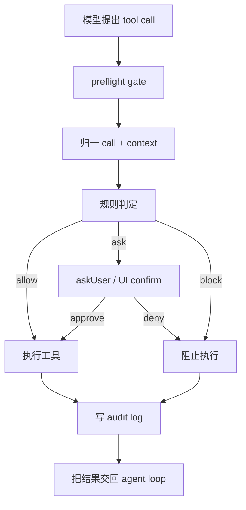

# s09 Permissions
## 本章要解决的问题

这一章回答一个很实际的问题：
当 agent 已经能读文件、写文件、改代码、跑 shell，它应该什么时候被允许直接执行？

具体要解决五件事：
- 哪些工具调用可以自动放行？
- 哪些动作必须先问人？
- 哪些动作无论模型怎么解释都应该阻止？
- 如何留下 audit log，让团队事后知道 agent 做过什么？
- workspace 外路径、凭证文件、shell 命令为什么是高风险区？

产品上，这不是“让 agent 变笨”。
它是在给强能力加可解释的出口。

没有权限系统的 agent，常见事故很朴素：
- 用户说“检查一下”，模型顺手写了文件。
- 用户说“装一下依赖”，模型跑了全局 `sudo npm install -g ...`。
- 用户说“看看配置”，模型读到了 `.env`。
- 用户说“清理缓存”，模型删了不该删的目录。
- 出事后，没人说得清是哪条工具调用造成的。

本章的目标，是把权限做成 harness 的 preflight gate：
工具真正执行前，先把调用变成一条结构化决策。

## 为什么上一章不够

s08 讲模型选择。
它解决的是：同一个 agent harness 如何适配不同 provider、消息格式和 session 继续。

但模型层解决不了权限问题。

原因很简单：
- 模型可以理解规则，但不能保证每次都遵守规则。
- prompt 可以提醒“不要读 `.env`”，但工具调用仍可能已经发出。
- provider 可以换，但本机文件系统、shell、凭证风险不会消失。
- 高风险动作需要确定性 gate，而不是自然语言建议。

所以权限应该靠 harness 执行，而不是靠模型自觉。

Pi 这类终端 coding harness 可以按四层理解：
- 模型负责提出下一步。
- 工具负责执行动作。
- harness 负责把上下文、权限、扩展、审计串起来。
- 人类在高风险节点保留最终决定权。

## 机制拆解

权限系统可以先拆成四个词：

1. `allow`：低风险动作，直接执行，例如读取 workspace 内普通源码文件。
2. `ask`：风险可接受，但需要人确认，例如读取 workspace 外文件或执行带 `sudo` 的命令。
3. `block`：风险不可接受，直接阻止，例如读取 `.env`、写 workspace 外路径、readonly 模式改文件。
4. `audit`：不管结果如何，都记录“谁想做什么、命中了什么规则、最终是否执行”。

一个实用的权限门至少有三层：
- 输入归一：把 tool call 变成统一结构。
- 规则判定：用稳定规则产出 `allow / ask / block`。
- 决策落盘：把 preflight 和最终结果写入 audit log。

本章代码把这个结构压缩成一个教学版：
- `PermissionDecision`：结构化表达权限结果。
- `preflightDecision(call, context)`：不问人，只看规则。
- `evaluatePermission(call, context)`：必要时调用 `askUser`，并写 audit log。
- `context.readonly`：模拟只读模式。
- `context.workspaceRoot`：模拟 workspace 边界。
- `context.auditLog`：模拟审计记录。

## Mermaid 图示



这张图里最重要的是 preflight gate 的位置。
它在工具执行前，而不是执行后。

如果工具已经读完 `.env`，再提醒模型“不要泄露凭证”就晚了。
如果 `rm -rf` 已经跑完，再做审计只能复盘，不能保护。

## 风险分类

本章重点看四类风险。

第一类是 workspace 风险。
workspace 是 agent 当前被授权工作的目录，读写都应该默认围绕它展开。

典型规则：
- 读 workspace 内文件：通常 allow。
- 读 workspace 外文件：通常 ask。
- 写 workspace 外文件：通常 block。
- 路径解析必须处理 `../`，不能只做字符串前缀判断。

第二类是 credential 风险。
`.env`、`.npmrc`、`id_rsa`、`credentials.json`、`secret*` 这类文件可能包含 API key、token、私钥、数据库密码。

典型规则：
- 读凭证路径：block。
- 写凭证路径：block，或只允许专门工具。
- shell 命令触碰凭证名：至少 block 或 ask。
- audit log 里不要记录凭证内容。

第三类是 shell 风险。
`bash` 是最强也最危险的工具之一，可以改文件、联网、安装依赖、启动后台进程、访问系统目录。

典型规则：
- `rg`、`ls`、`pwd` 这类查询命令：可 allow。
- `sudo`、`rm -rf`、`chmod 777`、`curl | sh`：至少 ask。
- 触碰凭证文件的命令：倾向 block。
- 生产环境命令：单独建规则，不能靠模型猜。

第四类是模式风险。
同一个工具调用，在不同模式下风险不一样。

例如 readonly 模式：
- `read README.md` 可以 allow。
- `write notes.md` 应该 block。
- `bash "rg xxx"` 可以 allow。
- `bash "npm test"` 可能写缓存或生成文件，教学版选择 block。

这就是 context 的价值：
权限不是只看工具名，还要看当前模式、workspace、用户身份、运行环境。

## 代码导读

运行：

```bash
node s09_permissions/code.mjs
```

这份代码不执行真实 shell，也不读写真实文件。
它只模拟工具调用进入权限门后的结果。

主要对象：
- `PermissionDecision`：统一表达 `allow / ask / block`，并携带 `reason`、`rule`、`details`。
- `preflightDecision(call, context)`：只做规则判定，不触发 UI，适合写单元测试。
- `evaluatePermission(call, context)`：调用 preflight；如果结果是 `ask`，再调用注入的 `context.askUser`；最后写入 `context.auditLog`。
- `askUser`：教学版用函数注入；真实产品里可能是 TUI confirm、Web 弹窗、企业审批流或 API 回调。
- `auditLog`：教学版是内存数组；真实产品里要考虑 session 归档、隐私脱敏、日志留存周期。

示例场景覆盖：
- 普通读写。
- 读取 workspace 外文件，触发 ask。
- 写 workspace 外文件，直接 block。
- 读取 `.env`，直接 block。
- `sudo npm install -g demo`，触发 ask 后被拒绝。
- `cat .env`，因为触碰凭证被 block。
- readonly 模式下允许只读查询，阻止写文件和非白名单 shell。

## 对应真实 Pi

截至 2026-05-28，本章按官方资料核验：
- Pi 当前官方仓库是 `earendil-works/pi`。
- Pi 当前 CLI 包名是 `@earendil-works/pi-coding-agent`。
- 官方文档里的 extension 入口类型是 `ExtensionAPI`。
- extension 可以监听 lifecycle events，包括工具相关事件。
- `tool_call` 在工具执行前触发。
- `tool_call` handler 可以通过返回 `{ block: true, reason }` 阻止工具执行。
- 官方文档说明 `tool_call` 中修改 `event.input` 会影响真实工具执行。
- 官方文档提供 `ctx.ui.confirm` 这类用户确认能力。
- 非交互模式下 UI 可能不可用，扩展应检查 `ctx.hasUI` 或设计降级策略。
- Pi 支持用 `-e, --extension <source>` 显式加载 extension，也支持禁用自动发现。

参考资料：
- [Pi Documentation](https://pi.dev/docs/latest)
- [Pi Extensions](https://pi.dev/docs/latest/extensions)
- [Using Pi](https://pi.dev/docs/latest/usage)
- [Pi Has a New Home at Earendil](https://pi.dev/news/2026/5/7/pi-has-a-new-home)

本仓库也有一个真实形态示例：[`.pi/extensions/protect-dangerous.ts`](../.pi/extensions/protect-dangerous.ts)。
它监听 `tool_call`，只处理 `bash`，匹配 `rm -rf`、`sudo`、写入 `.env` 等危险命令。
命中后用 `ctx.ui.confirm` 询问用户；用户拒绝时返回 block。

本章的 `PermissionDecision` 不是 Pi 官方 API 名称。
它是为了教学，把真实 extension hook 背后的产品机制显性化。

## 教学简化 vs 生产差异

本章代码故意简单。

教学简化：
- 不调用真实 Pi，也不执行真实 shell。
- 不读写真实文件系统。
- 不实现完整路径权限模型。
- 不解析 shell AST，只用正则识别高风险命令。
- 不处理多用户、多角色、多 workspace。
- audit log 只存在内存里。
- `askUser` 用固定策略模拟，不连接真实 UI。
- readonly 模式只做少量白名单。

生产差异：
- 路径判断要处理 symlink、大小写文件系统、mount、容器路径映射。
- shell 判断不能只靠正则，至少要有保守策略和 allowlist。
- 凭证保护要覆盖读取、搜索、命令输出、错误日志和 audit 脱敏。
- ask 流程要考虑无人值守、CI、RPC、JSON、print 等非交互模式。
- block 原因要给人看得懂，但不能泄露敏感细节。
- 多个 extension 的顺序会影响最终决策。
- 修改 `event.input` 后要小心，因为官方文档说明不会自动重新校验。
- 权限策略最好能测试，避免靠临场提示词。

一个稳妥的产品原则：
能自动证明低风险的才 allow；风险不清楚但可接受的 ask；涉及凭证、越界写入、破坏性动作的默认 block。

## 练习

1. 给 `dangerousShellPatterns` 增加 `git push --force`，观察它触发 ask。
2. 把 `askUser` 改成：只批准 `read`，拒绝所有 `bash`。
3. 增加一个 `network` 模式：readonly 下默认阻止 `curl`、`wget`、`ssh`。
4. 把 audit log 输出改成 JSON Lines，方便后续接入日志系统。
5. 新增规则：`edit package-lock.json` 需要 ask，普通源码文件 allow。
6. 思考：如果用户明确说“读取我的 .env”，教学版为什么仍然 block？
7. 思考：如果 agent 需要写 `.env.example`，规则应该如何区分它和 `.env`？
8. 设计一个团队策略表：动作、风险、默认决策、是否可被用户覆盖。

## 事实核验清单

写真实 Pi 权限 extension 前，至少核验：
- 当前官方仓库是否仍是 `earendil-works/pi`。
- 当前 CLI 包名是否仍是 `@earendil-works/pi-coding-agent`。
- `ExtensionAPI` 的导入路径是否变化。
- `.pi/extensions/*.ts` 和 `.pi/extensions/*/index.ts` 的自动发现规则是否变化。
- `-e, --extension <source>` 的显式加载方式是否变化。
- `tool_call` 的事件名、event 字段、block 返回语义是否变化。
- 修改 `event.input` 后是否仍然不会自动重新校验。
- `ctx.ui.confirm` 和 `ctx.hasUI` 在不同模式下的行为是否变化。
- 官方是否新增了更原生的 permission API。
- 你的扩展是否会和其他权限扩展发生顺序冲突。
- audit log 是否会记录敏感输入或命令输出。
- readonly 模式是否覆盖了 shell、edit、write、custom tools。

## 小结

权限不是 prompt 文案。
权限是工具执行前的产品机制。

本章的核心心法：
把 agent 的每一次真实动作，都先变成一条可解释、可测试、可审计的决策。
