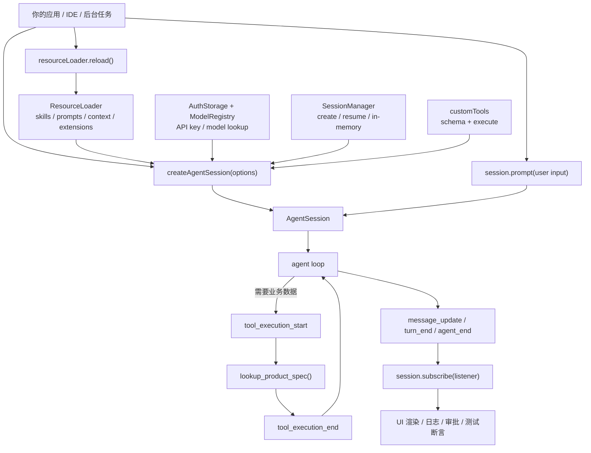

# s10 SDK Embed

## 本章要解决的问题
Pi 不只能作为终端命令使用。它也可以作为 agent harness，被嵌进你的产品、IDE、后台任务或自动化平台。

本章回答一个产品化问题：当用户不打开 `pi` 终端，而是在你的应用里触发 agent 时，你要接住哪些机制？

具体要解决六件事：
- CLI 和 SDK 的边界在哪里。
- `createAgentSession()` 创建了什么。
- session 从启动、prompt、工具执行、流式事件到结束，经历哪些阶段。
- `ResourceLoader` 为什么是嵌入式场景的关键接口。
- 自定义工具怎样以 schema 的形式接入 agent。
- event stream 怎样让 UI、日志、审批、测试系统看见 agent 正在做什么。

一句话：CLI 是 Pi 给人用的壳，SDK 是 Pi 给产品系统用的入口。

## 为什么上一章不够
s09 讲权限，解决的是：工具执行前，harness 如何判断 `allow / ask / block`。

但权限只回答“能不能做”，不回答“谁创建这个 agent、资源从哪里来、事件怎么回到产品”。

如果你要把 Pi 嵌进一个 Web IDE，光有权限门还不够：
- 用户点按钮后，你要创建或恢复一个 session。
- 项目资源不一定来自本机 `.pi/`，也可能来自数据库、租户配置或远端仓库。
- 工具不一定只有 `read/write/edit/bash`，还可能有“查 PRD”“查工单”“查知识库”。
- UI 需要实时展示模型输出、工具开始、工具结束、错误和队列状态。
- 后台任务需要知道一次 prompt 是否完成，不能只看终端屏幕。

所以 s10 的重点从“安全边界”推进到“产品集成边界”：把 Pi 当作可嵌入 runtime，而不是只当作 CLI。

## CLI vs SDK
可以把 CLI 和 SDK 看成同一个 harness 的两种外壳。

CLI 适合人直接操作：
- 入口是 `pi` 命令。
- UI 是终端 TUI、print、RPC 或 JSON 模式。
- 资源默认从当前目录、`~/.pi/agent`、`.pi/`、`.agents/` 等位置发现。
- session 由 Pi 管理，用户用 `/resume`、`/tree`、`/fork`、`/clone` 继续工作。

SDK 适合产品系统集成：
- 入口是 `createAgentSession()` 或更高阶的 runtime API。
- UI 由你的应用负责，Pi 通过事件告诉你发生了什么。
- 资源可以用 `DefaultResourceLoader`，也可以自定义 loader。
- session manager、auth storage、model registry、tools 都可以显式传入。

粗略判断：
- 终端协作：优先 CLI。
- Web IDE、内部平台、批处理、测试 harness：优先 SDK。
- 非 Node.js/TypeScript 应用，或需要进程隔离：考虑 RPC 或 JSON event stream。

## 机制拆解
SDK embedding 里最重要的五块是：

1. `createAgentSession()`：创建 `AgentSession`，装配模型、工具、资源、session manager、auth storage。
2. `session.prompt()`：向 session 发送用户输入；真实 Pi 还会处理 prompt templates、extension commands、消息队列和 agent loop。
3. `session.subscribe()`：订阅事件流；UI 应消费 `message_update`、`tool_execution_start/end`、`agent_end`，而不是猜状态。
4. `ResourceLoader`：供应 extensions、skills、prompt templates、themes、context files；默认 loader 面向标准目录，自定义 loader 面向产品配置中心。
5. `customTools`：把业务能力变成 agent 可调用工具；schema 描述输入，`execute` 连接真实系统，返回结构化结果。

这五块合在一起，才是“把 Pi 嵌进产品”的基本形态。

## Mermaid 图示


这张图里，`subscribe()` 是产品体验的耳朵。没有事件流，你只能等 `prompt()` 结束后看结果；有事件流，你能实时显示“模型正在说什么、哪个工具开始了、工具结果是否失败、当前 turn 是否结束”。

## Session Lifecycle
教学上可以把一个 SDK session 生命周期拆成七步：

1. 创建依赖：准备 auth、model、resource loader、session manager、custom tools。
2. 创建 session：调用 `createAgentSession(options)`。
3. 订阅事件：调用 `session.subscribe(listener)`，拿到 unsubscribe。
4. 发送 prompt：调用 `session.prompt(text, options)`。
5. 运行 loop：模型输出、工具调用、工具结果、下一轮判断。
6. 结束或排队：本轮完成，或因为 streaming 行为进入 steer/follow-up 队列。
7. 清理资源：不再使用时 unsubscribe，并调用 session 的清理方法。

重点不是背函数名，而是理解产品边界：session 是一次可观察、可恢复、可配置的 agent 工作现场。

## Resource Loader
Resource loader 是嵌入式场景里很容易被低估的一层。

CLI 里，资源通常来自文件系统：全局配置目录、当前项目 `.pi/`、上级目录里的 `AGENTS.md`、package 安装出来的 prompts、skills、extensions。

产品里，资源可能来自团队空间配置、项目数据库、企业知识库、用户权限系统、运行时动态 prompt，或 A/B 实验里的不同 skill 版本。

所以 SDK 的意义之一，是允许你接管 resource discovery。默认 loader 适合快速开始，自定义 loader 适合生产集成。

`resourceLoader.reload()` 的产品含义也很直接：资源变了，不一定要重启整个应用。你可以重新发现 prompts、skills、context files，再让下一轮 agent 使用新资源。

## Event Stream
SDK 事件流和 CLI 的 JSON event stream 是同一类产品机制：把 agent 内部进度变成结构化事件。

常见事件可以按四组理解：
- agent lifecycle：`agent_start`、`agent_end`。
- turn lifecycle：`turn_start`、`turn_end`。
- message lifecycle：`message_start`、`message_update`、`message_end`。
- tool lifecycle：`tool_execution_start`、`tool_execution_update`、`tool_execution_end`。

产品系统可以用它做很多事：显示流式文本、展示“正在查 PRD”、写审计日志、断言某个工具被调用、判断一次 prompt 是否真正完成。

不要把 event stream 只当作“漂亮动画”。它是可观察性、调试、审计和集成测试的基础。

## 代码导读
运行：

```bash
node s10_sdk_embed/code.mjs
```

本章代码不调用真实 Pi，也不发起 LLM 请求。它用本地 mock 表达 SDK embedding 的结构。

重点对象：
- `MockResourceLoader`：模拟 `ResourceLoader`，提供 `load()` 和 `reload()`。
- `defineTool()`：模拟 custom tool 定义，把 name、schema、execute 放在一起。
- `createAgentSession()`：模拟 session 工厂，装配 loader、session manager 和 custom tools。
- `session.subscribe(listener)`：订阅事件，返回取消订阅函数。
- `session.prompt(text)`：模拟一次 agent run，发出 lifecycle、message、tool 事件。
- `lookup_product_spec`：示例业务工具，输入是 `{ documentId }`，输出是 PRD 摘要。

读代码时按事件顺序看：先订阅事件，再 reload 资源，再 `session.prompt()`，观察 `tool_execution_start/end`，最后看 messages 和 audit log。

注意命名差异：本章 `code.mjs` 用 `schema` 表达教学版 custom tool 输入契约；真实 SDK 参考 [sdk-example.ts](sdk-example.ts) 使用官方示例里的 `parameters` 字段。

## 对应真实 Pi

> 事实基准:Pi monorepo commit `dbb9911a`(2026-05-30),npm `@earendil-works/pi-coding-agent@0.78.0`。以下 file:line 仅对该 commit 有效。

截至 commit `dbb9911a`，本章按官方 Pi 源码核验：
- Pi 官方 SDK 包含在 `@earendil-works/pi-coding-agent` 主包中。(`packages/coding-agent/src/index.ts:165`)
- 官方快速开始使用 `AuthStorage`、`ModelRegistry`、`SessionManager` 和 `createAgentSession()`。
- `createAgentSession()` 是创建单个 `AgentSession` 的主要工厂函数；返回 `{ session, extensionsResult, modelFallbackMessage? }`。(`packages/coding-agent/src/core/sdk.ts:204`, `packages/coding-agent/src/core/sdk.ts:86`)
- 如果不传自定义 `ResourceLoader`，会自动构造 `DefaultResourceLoader` 并 `await reload()`。(`packages/coding-agent/src/core/sdk.ts:218`)
- `AgentSession` 暴露 `prompt()`、`steer()`、`followUp()`、`subscribe()`、`setModel()`、`compact()`、`abort()`、`dispose()` 等能力。(`packages/coding-agent/src/core/agent-session.ts:254`)
- session replacement，例如 new session、resume、fork、import，属于 `AgentSessionRuntime` 层，不是普通 `AgentSession` 自身职责。(`packages/coding-agent/src/core/agent-session-runtime.ts:68`)
- 官方事件类型包含 `message_update`、`tool_execution_start/update/end`、`agent_start/end`、`turn_start/end` 等。(`packages/agent/src/types.ts:403`)
- SDK 支持 `customTools`（`ToolDefinition[]`）和 `defineTool()`；`tools` 选项是工具名字符串数组（allowlist），而非 Tool 实例。(`packages/coding-agent/src/core/sdk.ts:417`, `packages/coding-agent/src/core/sdk.ts:67`)
- 官方导出列表包含 `DefaultResourceLoader`、`ResourceLoader`（类型）、`defineTool`、`createAgentSession`、`createAgentSessionRuntime`、`AgentSessionRuntime`、tool factories 和相关类型。(`packages/coding-agent/src/index.ts:163`, `packages/coding-agent/src/index.ts:177`)
- 对非 Node.js 或需要进程隔离的集成，官方文档提供 RPC mode 与 JSON event stream mode。

参考资料：
- [Pi SDK](https://pi.dev/docs/latest/sdk) (`packages/coding-agent/src/core/sdk.ts:204`)
- [Pi RPC Mode](https://pi.dev/docs/latest/rpc) (`packages/coding-agent/docs/rpc.md`, `packages/coding-agent/src/modes/rpc/rpc-mode.ts:53`)
- [Pi JSON Event Stream Mode](https://pi.dev/docs/latest/json) (`packages/coding-agent/docs/json.md`)
- [Pi GitHub Repository](https://github.com/earendil-works/pi-mono)

真实 SDK 参考代码见 [sdk-example.ts](sdk-example.ts)。它按 commit `dbb9911a` 官方 SDK 源码整理，但不会被 `npm run check` type-check；写生产代码前要重新核验当前 quickstart、导出列表和函数签名。

## 教学简化 vs 生产差异
本章 mock 刻意做了很多简化。

教学简化：
- 不安装真实 Pi 依赖，不连接真实模型。
- 不读取真实 `.pi/`、`.agents/`、`AGENTS.md`。
- 不实现 prompt template expansion、extension commands、steer/follow-up 队列。
- 不实现 session tree、resume、fork、clone。
- tool schema 只做轻量校验，不做完整运行时校验。
- 事件顺序是固定脚本，不代表真实模型每次都会调用同一个工具。

生产差异：
- auth storage 要处理 API key、OAuth、环境变量、租户隔离和密钥轮换。
- model registry 要处理可用模型、默认模型、降级策略和成本控制。
- resource loader 要处理权限、缓存、版本、reload 失败和资源冲突。
- custom tool 要做输入校验、权限检查、超时、重试、脱敏和审计。
- event stream 要处理断线重连、重复事件、后台任务状态和错误归因。
- session manager 要考虑持久化、并发写、迁移、删除、导出和隐私。
- UI 集成要区分“prompt 已接受”和“agent 已完成”。
- runtime replacement 后要重新订阅新的 session。

一个稳妥的产品原则：SDK 不是让你绕开 CLI 的安全边界，而是让你把这些边界搬进自己的产品系统。

## 练习
1. 给 `MockResourceLoader` 增加 `skills`，并在 `reload()` 后打印 skill 数量。
2. 给 `lookup_product_spec` 增加必填字段校验，缺少 `documentId` 时发出 error 事件。
3. 增加第二个 custom tool：`create_tracking_ticket`。
4. 修改 `session.prompt()`，让它根据用户输入决定是否调用工具。
5. 增加 `session.steer()`，模拟 streaming 期间插入 steering message。
6. 增加 `session.dispose()`，dispose 后再次 prompt 应该抛错。
7. 把事件保存为 JSON Lines，模拟 CLI 的 JSON event stream。
8. 设计一个 Web UI：哪些事件显示给用户，哪些只写内部日志？

## 事实核验清单
写真实 Pi SDK 集成前，至少核验：
- 当前 CLI / SDK 包名是否仍是 `@earendil-works/pi-coding-agent`。
- SDK 是否仍包含在主包中，而不是拆成独立包。
- `createAgentSession()` 的参数和返回值是否变化。
- `AgentSession.prompt()` 是否仍是发送用户输入的主要方法。
- `session.subscribe()` 返回值和事件类型是否变化。
- `DefaultResourceLoader` 的导入路径是否变化。
- `ResourceLoader` 当前需要实现哪些方法，`reload()` 语义和错误处理是否变化。
- `customTools` 与 `defineTool()` 的 schema 写法是否变化。
- `SessionManager.inMemory()`、`SessionManager.create()` 的签名是否变化。
- `AuthStorage.create()` 与 `ModelRegistry.create()` 的默认路径是否变化。
- session replacement 是否仍由 `AgentSessionRuntime` 负责。
- RPC mode 和 JSON event stream mode 的命令、事件和 JSONL framing 是否变化。
- 你的产品是否需要进程隔离；如果需要，SDK 可能不是最佳入口。

## 小结
SDK embedding 的本质，不是“在代码里跑一个聊天机器人”。它是把 Pi 的 harness 能力接到你的产品边界上：资源由你供给，工具由你定义，事件由你消费，session 由你管理。

学完这一章，你应该能问出四个关键问题：谁创建 session？资源从哪里来？工具怎样受控执行？事件回到哪里？
