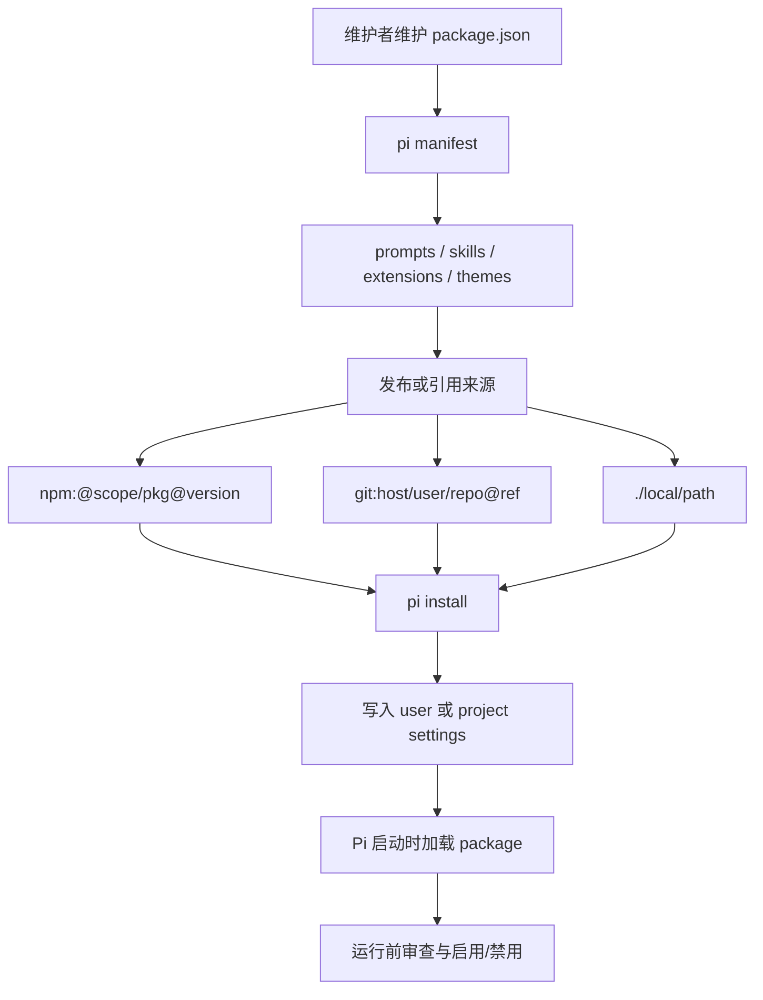

# s11 Pi Packages

## 本章要解决的问题

前面几章已经分别讲过 prompts、skills、extensions、themes；本章解决更靠近产品化的问题：这些能力稳定之后，如何打包、审查、安装、升级，并让团队复用？

具体要回答：
- package manifest 应该写什么。
- prompts、skills、extensions、themes 如何被声明为资源。
- npm、git、本地路径三类来源有什么差异。
- 为什么 extension package 必须做安全审查。
- Pi 核心包为什么应该放在 `peerDependencies`。
- 如何检查资源路径空值、绝对路径和危险安装脚本。
- 教学 demo 为什么只做静态检查，不真的安装包。

这章的关键词不是“写 npm library”，而是 agent harness 的扩展分发机制：默认加载哪些能力、来自哪里、是否审过、升级时会不会偷偷变。

## 为什么上一章不够

上一章讲 SDK embedding，解决的是把 Pi agent 能力嵌入自己的 Node.js 应用、内部平台或自动化系统，但它没有解决团队分发问题。

如果没有 package 机制，会很快遇到这些麻烦：
- A 同学的 `.pi/prompts` 和 B 同学不一致。
- extension 修了 bug，但不知道哪些项目还在旧版本。
- skills 被复制到多个仓库，改一次要到处同步。
- 安装来源混乱：npm、git main、本地目录混用。
- package 带了安装脚本或可执行代码，但没有审查清单。
- Pi 核心包被错误打进依赖，导致运行时出现多份 API 类型或版本冲突。

所以 s11 补上的不是“更多文件格式”，而是把单机可用能力变成可声明、可安装、可审查、可升级的能力包。

## 一句话模型

Pi package 可以理解成一个带 `pi` manifest 的 `package.json`。
这个 manifest 告诉 Pi：这里有哪些 prompt templates、skills、extensions、themes；安装来源可以是 npm 包、git 仓库、本地文件或目录。
安装动作不是单纯下载 library，而是把一组 agent 资源注册进 Pi 的运行上下文。

## Manifest 最小形态

本章样例见 [package.example.json](package.example.json)。

```json
{
  "name": "@example/pi-product-workflows",
  "version": "0.1.0",
  "keywords": ["pi-package"],
  "pi": {
    "prompts": ["prompts/*.md"],
    "skills": ["skills"],
    "extensions": ["extensions/*.ts"],
    "themes": ["themes/*.json"]
  },
  "peerDependencies": {
    "@earendil-works/pi-coding-agent": "*",
    "typebox": "*"
  }
}
```

- `keywords` 里加 `pi-package`，方便 package gallery 和搜索系统识别。
- `pi` 字段声明资源路径；路径相对 package root，可以是目录，也可以是 glob。
- Pi 核心包放到 `peerDependencies`；extension 常见的 `ExtensionAPI` 来自 `@earendil-works/pi-coding-agent`，schema 常用 `typebox`。

## Mermaid 图示



这张图的重点是：package 的价值不在“文件放在哪里”，而在“资源来源和加载边界被显性声明”。

## 机制拆解

### 1. 资源声明

Pi package 可以声明四类资源：
- `prompts`：可复用的 prompt templates。
- `skills`：面向任务的 Agent Skill。
- `extensions`：能注册工具、命令、事件和 UI 的代码扩展。
- `themes`：终端界面主题。

真实 Pi 也支持约定目录发现；但新手和团队协作优先写 manifest，因为显式声明更容易 review，也更容易解释“这个包到底加载了什么”。

### 2. 安装来源

官方文档列出的常见来源包括：

```bash
pi install npm:@foo/bar@1.0.0
pi install git:github.com/user/repo@v1
pi install https://github.com/user/repo@v1
pi install /absolute/path/to/package
pi install ./relative/path/to/package
```

npm 来源适合稳定发布；版本号固定后，升级节奏更可控。
git 来源适合内部包或未发布包，最好 pin 到 tag 或 commit；local 来源适合开发调试，但本地目录一改，真实加载内容也变了。

### 3. Settings 作用域

真实 Pi 默认把 install/remove 写到用户级 settings；也可以写到项目级 settings，让项目自动加载团队共享 package。
产品上可以这样理解：
- 用户级：我个人常用的一套能力。
- 项目级：这个仓库或团队约定的一套能力。

团队包通常更适合项目级；但越是项目级，越应该重视安全审查。

### 4. 安全审查

Pi package 里最敏感的是 extension：它是代码，可能读文件、跑命令、访问网络、注册工具、改变 UI 或影响 agent 行为。
skills 虽然不是直接执行的程序，也可能指示模型执行高风险动作。

安装第三方 package 前，至少要看：
- 是否有 `extensions`。
- 是否有 `preinstall`、`postinstall`、`prepare` 等生命周期脚本。
- 是否请求了异常 dependencies。
- 是否访问 shell、文件系统、网络、剪贴板、凭证路径。
- npm 包是否 pin 版本。
- git 来源是否 pin ref。
- 本地来源是否只是临时开发用。

本章 checker 会输出 warning，但不会替人做最终判断；安全审查不是“看到 warning 就不能用”，而是让人知道自己在批准什么。

### 5. Peer dependency

官方文档建议：如果 extension 或 skill import Pi 核心包，应把这些包列入 `peerDependencies`，通常用 `"*"` 范围，不要 bundle。
常见核心包包括：
- `@earendil-works/pi-ai`
- `@earendil-works/pi-agent-core`
- `@earendil-works/pi-coding-agent`
- `@earendil-works/pi-tui`
- `typebox`

原因是 Pi 运行时本身已经提供这些核心能力；如果 package 自己再 bundle 一份，可能出现重复实例、类型不一致或运行时行为不一致。
普通第三方运行时依赖，例如 `zod`、`yaml`、`minimatch`，才应该放在 `dependencies`。

## 代码导读

```bash
node s11_packages/code.mjs
```

这份代码不安装 npm 包，不 clone git，也不加载真实 extension，只做三类教学检查。

Manifest 检查：
- package 是否有 `name` 和 `version`。
- `keywords` 是否包含 `pi-package`。
- `pi.prompts / skills / extensions / themes` 是否为数组。
- 资源路径是否为空字符串或绝对路径。
- 是否至少声明了一类资源。

Peer dependency 检查：
- 有 extension 时，是否 peer-depend on `@earendil-works/pi-coding-agent`。
- Pi 核心包是否误放到了 `dependencies`。
- 核心 peer dependency 是否使用 `"*"`。

Package source normalization：
- `npm:@example/pkg@0.1.0` 会归一成 npm 来源。
- `git:github.com/acme/repo@v1.0.0` 会归一成 git 来源。
- `./s11_packages` 会解析成本地绝对路径。
- object form 会保留 filters，例如只启用部分 extensions 或禁用 skills。

输出里的 `warnings` 是教学重点，会提示 extension 有代码执行风险、本地来源可变、未 pin npm 版本等问题。

## 对应真实 Pi

截至 2026-05-28，本章按官方资料核验：
- Pi 官方文档把 Pi 描述为 minimal terminal coding harness，可通过 TypeScript extensions、skills、prompt templates、themes、packages 扩展。
- 当前 CLI 包名是 `@earendil-works/pi-coding-agent`。
- Pi package 可以通过 `package.json` 的 `pi` 字段声明 `extensions`、`skills`、`prompts`、`themes`。
- package 也可以靠约定目录发现资源。
- 官方 install 示例覆盖 npm、git、raw GitHub URL、本地绝对路径、本地相对路径。
- 官方安全提醒明确指出 package 里的 extension 会以用户系统权限运行，第三方 package 安装前要 review。
- runtime dependencies 应放在 `dependencies`。
- Pi 核心包和 `typebox` 应作为 `peerDependencies`，不要 bundle。
- package gallery 使用 `pi-package` keyword 做发现信号。

参考资料：
- [Pi Documentation](https://pi.dev/docs/latest)
- [Pi Packages](https://github.com/earendil-works/pi/blob/main/packages/coding-agent/docs/packages.md)
- [Pi Extensions](https://pi.dev/docs/latest/extensions)
- [Pi Has a New Home at Earendil](https://pi.dev/news/2026/5/7/pi-has-a-new-home)

## 教学简化 vs 生产差异

本章代码是 package manifest checker，不是真实 Pi installer。

教学简化：
- 不运行 `pi install`。
- 不访问 npm registry。
- 不 clone git。
- 不读取真实 package 目录里的资源文件。
- 不解析 extension 源码 import。
- 不执行生命周期脚本。
- 不判断 package 签名、作者身份或供应链信誉。
- 不实现完整 settings 写入和 package dedup。

生产差异：
- 真实 Pi 会根据用户级或项目级 settings 加载 package。
- npm 和 git package 安装会涉及依赖安装。
- git ref、npm version、package lock、registry provenance 都会影响供应链可信度。
- 本地路径要考虑相对路径基准、symlink、workspace 边界和多人协作。
- 资源过滤可以进一步细分到启用/禁用某些 extension、skill、prompt 或 theme。
- 安全审查最好结合源码 diff、依赖审计、最小权限和团队审批。

本章故意把 installer 简化成 checker，是为了先看清 manifest 与来源的产品机制，而不是陷入包管理细节。

## 练习

1. 把 [package.example.json](package.example.json) 的 `keywords` 里的 `pi-package` 删除，观察 checker 报错。
2. 把 `pi.extensions` 改成 `[""]`，观察资源路径空值检查。
3. 把 `@earendil-works/pi-coding-agent` 从 `peerDependencies` 移到 `dependencies`，观察 warning 或 error。
4. 在 `code.mjs` 的 `packageSources` 里加入 `git:github.com/acme/repo`，观察未 pin ref 的 warning。
5. 在 `packageSources` 里加入 object form，只加载某一个 prompt，禁用 skills。
6. 思考：团队共享 package 应该写进用户 settings，还是项目 settings？
7. 思考：一个 package 只有 prompts，没有 extensions，安全审查是否可以降级？
8. 设计 package review 表：来源、版本、资源类型、权限风险、审批人、回滚方式。

## 事实核验清单

- 当前官方仓库是否仍是 `earendil-works/pi`。
- 当前 CLI 包名是否仍是 `@earendil-works/pi-coding-agent`。
- `pi` manifest 支持的资源键是否仍是 `extensions / skills / prompts / themes`。
- 约定目录发现规则是否变化。
- `pi install` 对 npm、git、本地路径的 source 语法是否变化。
- git ref pin、npm version pin、`pi update` 的行为是否变化。
- 用户级 settings 与项目级 settings 的路径和优先级是否变化。
- package filtering 的 object form 是否变化。
- `pi-package` keyword 是否仍是 gallery/discovery 信号。
- 官方 peer dependency 列表是否新增或删减。
- runtime dependencies 与 devDependencies 的安装规则是否变化。
- extension 的安全模型、权限边界和 UI confirm 能力是否变化。

## 小结

Package 是把 Pi 扩展能力产品化的一层。
prompts、skills、extensions、themes 是资源；manifest 是声明；source 是供应链入口。
安全审查是安装前的产品责任；peer dependency 是让 package 和 Pi 运行时保持一致的工程约定。
