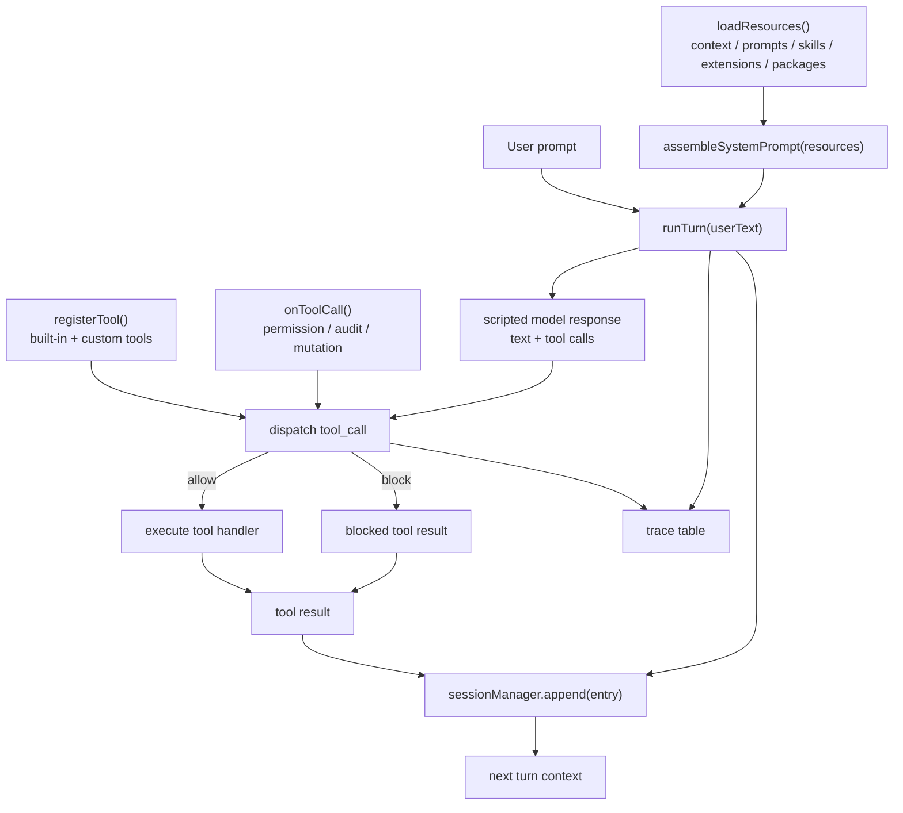

# s12 Comprehensive
## 本章要解决的问题
前 11 章已经把 Pi 类 coding agent 拆成了很多机制。
现在的问题是：这些机制怎样重新装回一个完整 harness？
本章不会声称复刻 Pi 内部实现。
我们只做一件事：把 s01-s11 的产品机制汇总成一个可运行的 mock harness 架构。
你会看到资源加载、系统提示词、工具注册、工具前置 hook、权限决策、session 追加、trace 观测，怎样围绕同一个 agent loop 协作。
一句话：
```text
harness 不是模型本身，而是把模型、上下文、工具、权限、扩展和状态装配起来的运行时。
```
## 为什么上一章不够
s11 讲 Pi packages，解决的是“prompts、skills、extensions、themes 怎样分发”。
但 package 只是资源来源，不是运行时总线。
一个 package 可以带来 skill、prompt template、extension 和 theme。
它仍然需要 harness 决定：
- 资源什么时候加载。
- 哪些内容进入系统提示词。
- 哪些工具注册给模型。
- 哪些工具调用要先过 hook。
- 权限拒绝怎样回到模型上下文。
- session 怎样记录发生过什么。
- UI 和日志怎样看见 agent 正在做什么。
所以 s12 要把问题从“资源怎么分发”推进到“资源怎样参与一次真实 turn”。
## 总体心智模型
一个完整 coding agent harness 至少有三层。
第一层是模型看到的输入：system prompt、用户消息、历史消息、工具结果。
第二层是模型可以请求的动作：tool registry、active tools、custom tools、bash、read、edit、write。
第三层是模型看不见但产品必须掌握的控制面：resource loader、permissions、extension hooks、session manager、trace、auth、model registry。
不要把这些机制理解成“让模型更聪明的咒语”。
更准确的说法是：它们让模型提出的动作变得可执行、可限制、可恢复、可审计。
## Mermaid 图示

这张图要表达两个边界。
第一，system prompt 只影响模型判断，不能替代权限 gate。
第二，session 和 trace 都记录事实，但服务对象不同：session 用于恢复上下文，trace 用于人类调试和审计。
## 机制拆解
| 章节 | 机制 | 在总装 harness 里的位置 |
|---|---|---|
| s01 | agent loop | `runTurn()` 的主闭环 |
| s02 | tool dispatch | `registerTool()` 和 dispatch 查表 |
| s03 | context files | `loadResources()` 读取长期项目规则 |
| s04 | prompt templates | 作为 slash command 资源进入 catalog |
| s05 | skills | 先进入 skill catalog，需要时再读全文 |
| s06 | extensions | 通过 hook 和 custom tool 改变 runtime |
| s07 | sessions | `sessionManager.append()` 记录可恢复历史 |
| s08 | models | model registry / adapter 决定请求发给谁 |
| s09 | permissions | `onToolCall()` 前置决策 allow / block |
| s10 | SDK embed | `createMockHarness()` 模拟可嵌入入口 |
| s11 | packages | 为资源加载层提供可分发来源 |
### 1. ResourceLoader 是资源入口
ResourceLoader 不直接替模型做决定。
它负责把多种资源收拢成当前 session 可用的清单。
教学版只返回内存对象：context files、prompt templates、skills、extensions、package resources。
真实产品里，资源可能来自本地目录、全局配置、项目配置、package、settings、CLI 参数，甚至你的业务数据库。
### 2. System prompt 是组装结果
系统提示词不是一整块手写长文。
它更像编译产物：基础身份 + context rules + prompt commands + skill catalog + safety notes。
本章的 `assembleSystemPrompt()` 会保留来源边界。
来源边界很重要，因为“团队规则”和“用户粘贴资料”不能拥有同等优先级。
### 3. Tool registry 让 loop 保持小
主循环不应该知道每个工具的业务细节。
它只需要知道：工具名能不能查到，参数是否可用，执行前 hook 是否放行，handler 返回什么。
新增工具应该调用 `registerTool()`。
如果新增工具必须改 `runTurn()`，说明 harness 边界开始变脆。
### 4. Hook 是运行时控制面
Prompt、context file、skill 都属于“告诉模型应该怎么做”。
Hook 属于“工具执行前后，harness 确实会做什么”。
本章用 `onToolCall()` 模拟 extension prehook。
它可以阻止危险 bash，也可以写 audit trace。
### 5. Permission 是确定性 gate
权限不能只靠自然语言提醒。
模型可以请求 `bash("rm -rf dist")`，但 harness 可以把它变成 blocked tool result。
被拒绝的结果仍然回到 session，让下一轮模型知道：这条路走不通，需要换一个安全动作。
### 6. Session 是可恢复状态
Session 不是普通聊天日志。
它要记录用户消息、assistant 消息、tool result、模型切换、摘要、分支等状态。
教学版只实现 `append()` 和 active leaf。
但你要记住产品含义：下一轮上下文应该从 session 重建，而不是靠 UI 上看起来最后一条消息。
### 7. Trace 是可观察性
Trace 不一定进入模型上下文。
它给人和系统看：资源何时加载、工具何时注册、hook 做了什么、权限为什么拒绝、最终追加了哪些 session entry。
当 agent 行为看起来“奇怪”时，trace 往往比长聊天记录更容易定位问题。
### 8. Model layer 是翻译层
本章代码不调用真实模型。
但总装架构里必须给 model layer 留位置。
原因是 provider、model、API type、tool call 格式、reasoning 参数和 auth 都不应该散落在 loop 里。
一个成熟 harness 会把模型差异收口到 registry 和 adapter。
### 9. Package 是资源供应链
Package 解决复用和分发。
它不自动让资源可信。
带 extension 的 package 尤其要 review，因为 extension 是代码，可以影响工具、命令、UI 和事件。
### 10. SDK embed 是产品集成入口
当你把 agent 放进 Web IDE、内部平台或后台任务时，CLI 外壳不够用。
你需要一个可编程入口创建 session、传入 ResourceLoader、注册 custom tools、订阅事件、接入权限和日志。
本章 `createMockHarness()` 就是这种入口的教学版。
## 代码导读
运行：
```bash
node s12_comprehensive/code.mjs
```
这份代码不会调用真实 Pi，也不会读写真实磁盘。
它演示一个完整 turn：
1. `createMockHarness()` 创建内存版 harness。
2. `loadResources()` 加载 context、prompt、skill、extension、package catalog。
3. `assembleSystemPrompt()` 把资源组装成可读系统提示词。
4. `registerTool()` 注册 `read`、`bash`、`project_note` 三个工具。
5. `onToolCall()` 注册一个权限 hook，阻止危险 `rm -rf`。
6. `runTurn()` 写入 user message，执行 scripted assistant 的 tool calls。
7. 每个工具结果都通过 `sessionManager.append()` 追加到 session。
8. 最后用 `console.table()` 输出 trace 表。
代码里最值得看的不是模拟模型的剧本，而是边界：
- `runTurn()` 不知道 `read` 怎样读内容。
- `bash` 是否危险不由模型解释决定。
- 被 block 的工具调用不是异常崩溃，而是稳定 tool result。
- session entry 和 trace event 分开保存。
## 对应真实 Pi
> 事实基准:Pi monorepo commit `dbb9911a`(2026-05-30),npm `@earendil-works/pi-coding-agent@0.78.0`。以下 file:line 仅对该 commit 有效。

截至 2026-05-30，下面这些是本章映射到真实 Pi 的公开机制依据。
- Pi 官方文档把 Pi 定位为 minimal terminal coding harness，并说明核心保持小，通过 TypeScript extensions、skills、prompt templates、themes、packages 扩展：[Pi Documentation](https://pi.dev/docs/latest)。
- SDK 文档说明 `createAgentSession()` 会使用 `ResourceLoader` 供应 extensions、skills、prompt templates、themes 和 context files；默认使用 `DefaultResourceLoader`：[Pi SDK](https://pi.dev/docs/latest/sdk)（`packages/coding-agent/src/core/sdk.ts:204`、`packages/coding-agent/src/core/resource-loader.ts:28`、`packages/coding-agent/src/core/resource-loader.ts:152`）。
- SDK 文档列出内置工具名，默认内置工具包括 `read`、`bash`、`edit`、`write`，也可选择 `grep`、`find`、`ls`：[Pi SDK Tools](https://pi.dev/docs/latest/sdk)（`packages/coding-agent/src/core/tools/index.ts:83`、`packages/coding-agent/src/core/sdk.ts:282`）。
- Extension 文档说明扩展可订阅事件、注册工具、注册命令，并通过 `tool_call` 这类工具事件在执行前介入：[Pi Extensions](https://pi.dev/docs/latest/extensions)（`packages/coding-agent/src/core/extensions/types.ts:818`、`packages/coding-agent/src/core/extensions/types.ts:1135`）。
- Session format 文档说明 session 是 JSONL，entry 通过 `id` / `parentId` 形成 tree，用于 in-place branching：[Pi Session Format](https://pi.dev/docs/latest/session-format)（`packages/coding-agent/docs/session-format.md:3`、`packages/coding-agent/src/core/session-manager.ts:138-147`）。
- Package 文档说明 Pi packages 可以声明 extensions、skills、prompt templates、themes，用于 npm、git 或本地资源分发：[Pi Packages](https://pi.dev/docs/latest/packages)（`packages/coding-agent/docs/packages.md§Creating a Pi Package`、`packages/coding-agent/docs/packages.md§Package Sources`）。
这些依据只支持“机制对应”。
它们不支持我们宣称本章代码就是 Pi 源码、内部类名、真实执行顺序或完整协议。
## 教学简化 vs 生产差异
| 主题 | 本章教学版 | 真实 Pi / 生产系统 |
|---|---|---|
| 模型 | scripted assistant | 真实 LLM、streaming、重试、usage、cost |
| 资源 | 内存数组 | 多目录发现、settings、package、reload diagnostics |
| Prompt | 简单字符串拼接 | 更复杂的系统提示词、资源来源、token 管理 |
| 工具 | 三个 mock tool | 内置工具、extension tool、customTools、schema 校验 |
| 权限 | 一个 hook block `rm -rf` | 多规则、ask UI、非交互降级、审计、策略测试 |
| Session | 只 append entry | JSONL、tree、resume、fork、clone、compaction |
| Model | 不发 API 请求 | provider registry、auth、adapter、compat flags |
| Package | 只作为 catalog | 安装、过滤、启停、依赖、供应链安全 |
| Trace | `console.table()` | structured event stream、RPC、日志、可视化调试 |
最重要的差异：生产 harness 的每一层都要处理失败。
资源加载会失败，工具会超时，hook 会抛错，用户会拒绝授权，session 文件会损坏，模型会返回不完整 tool call。
教学版只保留主路径和一个 blocked 分支，是为了让结构先清楚。
## 练习
1. 给 `loadResources()` 增加一个 prompt template，并让 system prompt 中出现它。
2. 新增 `grep` 工具，要求不改 `runTurn()` 主体，只用 `registerTool()` 接入。
3. 把权限 hook 改成：`rm -rf` 直接 block，`sudo` 返回 ask，但用教学版固定拒绝。
4. 给 `sessionManager.append()` 增加 `parentId`，让它更像 session tree。
5. 让 trace event 带上 `sessionEntryId`，观察工具结果和 session 记录如何对齐。
6. 模拟 `resourceLoader.reload()`，让第二轮 turn 使用新的 skill catalog。
7. 把 `project_note` 工具改成从 package resource 注册，思考 package 安装前要 review 什么。
8. 设计一个产品 UI：哪些 trace 给用户看，哪些只进内部日志？
## 事实核验清单
写 s12 这种总装章时，尤其不要凭记忆写真实 Pi 细节。
- Pi 官方文档入口是否仍是 `https://pi.dev/docs/latest`。
- 官方仓库和 npm scope 是否仍是当前写法。
- CLI / SDK 包名是否仍是 `@earendil-works/pi-coding-agent`。
- `createAgentSession()`、`DefaultResourceLoader`、`ResourceLoader` 的说明是否变化。
- 默认内置工具和可选只读工具列表是否变化。
- Extension 的 `tool_call` 事件、block 语义、工具注册 API 是否变化。
- Context files、prompt templates、skills 的发现路径是否变化。
- Session format 当前版本、entry 类型、tree 语义是否变化。
- Package manifest 的 `pi` 字段和 resource kinds 是否变化。
- 是否把教学 mock 的函数名误写成真实 Pi 内部实现。
- 是否把 skill、context file 说成了权限系统。
- 是否把 package 说成了天然可信资源。
## 小结
s12 的重点不是“写一个更大的 demo”。
重点是把前 11 章放回一张产品架构图里。
Pi 类 harness 的核心能力不是某一个神奇 prompt，而是一组清晰边界：资源进来，提示词组装，模型提出动作，工具被调度，权限先拦截，结果写回 session，trace 让系统可观察。
只要这条链路清楚，你就能判断新需求应该放在哪里：是 context、template、skill、extension、permission、model、session、package，还是 SDK 集成层。

## 下一步怎么学

- 如果你关心产品设计，回到每章的“为什么上一章不够”，把它们串成一条 agent harness 的需求演化线。
- 如果你关心工程实现，逐章比较 `code.mjs` 的边界：哪些逻辑留在 loop，哪些被拆到 registry、ResourceLoader、extension、permission gate 或 session manager。
- 如果你要做真实 Pi 集成，优先读官方 SDK、Extensions、Packages、Sessions 文档，再把本仓库当作概念地图，而不是 API 手册。

## 交付检查

- 能否用一张图解释资源、模型、工具、权限、session 的位置。
- 能否指出每个 mock 函数对应的是产品机制，而不是 Pi 私有实现。
- 能否说清一个新需求应该落在 prompt template、skill、extension、permission、package 还是 SDK 层。
- 能否在公开 repo 中明确区分官方事实、第三方资料和教学简化。
- 能否跑通 `npm run check`，并从输出里看到每章 demo 的观察点。
